- [ECS](#ecs)
  - [ECS稀疏集实现](#ecs稀疏集实现)
  - [ECS总结](#ecs总结)
- [UML图](#uml图)
  - [UML对象和类](#uml对象和类)
  - [UML对象间关系](#uml对象间关系)
- [SOLID原则](#solid原则)
  - [单一职责原则](#单一职责原则)
  - [开闭原则](#开闭原则)
  - [里氏替换原则](#里氏替换原则)
  - [接口隔离原则](#接口隔离原则)
  - [依赖倒置原则](#依赖倒置原则)
- [组合优于继承](#组合优于继承)
- [设计模式](#设计模式)
  - [总结](#总结)
    - [创建型模式](#创建型模式)
    - [结构型模式](#结构型模式)
    - [行为型模式](#行为型模式)
  - [单例模式](#单例模式)
  - [组合模式](#组合模式)
  - [责任链模式](#责任链模式)
  - [模板方法模式](#模板方法模式)
  - [原型模式](#原型模式)
  - [工厂方法模式](#工厂方法模式)
  - [状态模式](#状态模式)
  - [对象池模式](#对象池模式)
  - [外观模式](#外观模式)
  - [策略模式](#策略模式)
  - [生成器模式](#生成器模式)
    - [分解复杂的对象构建过程](#分解复杂的对象构建过程)
    - [通过继承来扩展生成器](#通过继承来扩展生成器)
  - [命令模式](#命令模式)
    - [重构输入处理](#重构输入处理)
    - [封装请求为对象](#封装请求为对象)
  - [观察者模式](#观察者模式)
  - [脏标识模式](#脏标识模式)
  - [服务定位器模式](#服务定位器模式)
  - [装饰模式](#装饰模式)
  
## ECS

[ECS框架详解](https://www.bilibili.com/video/BV1XTxuzfEB9)

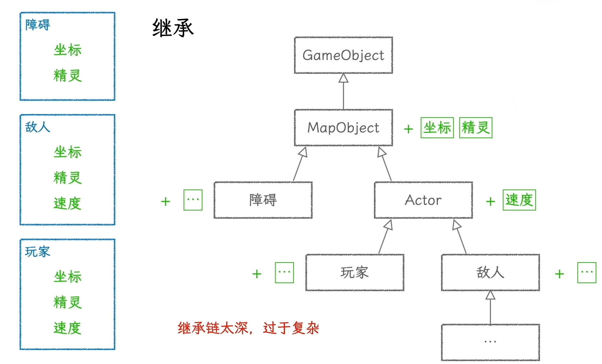

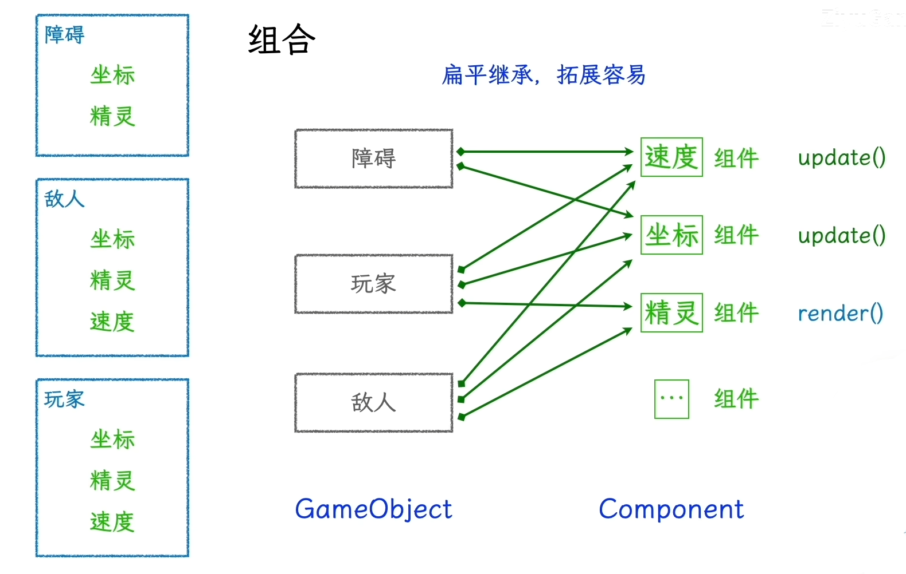

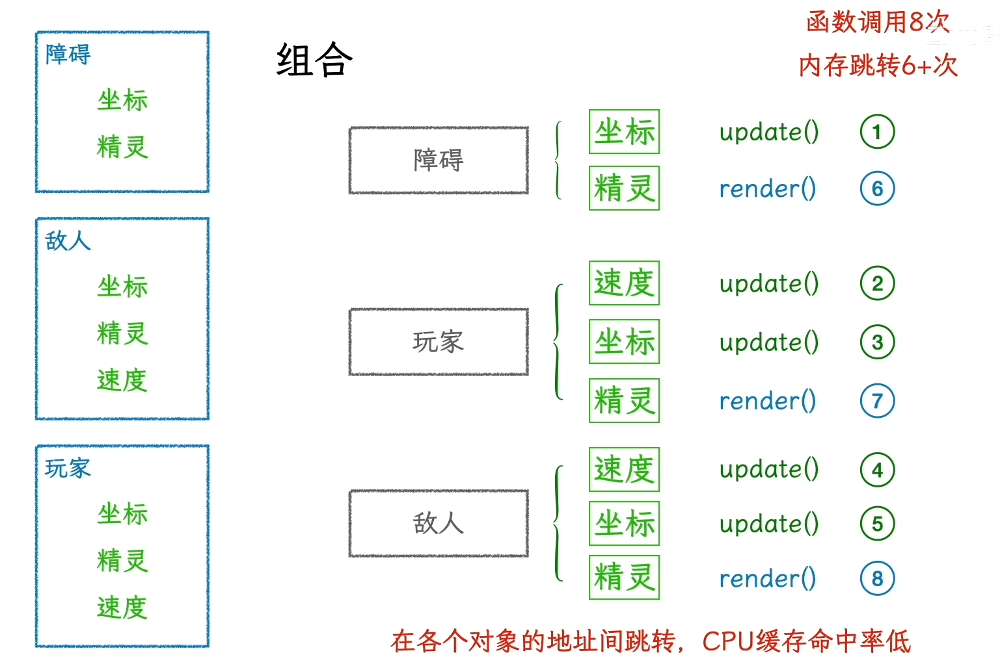

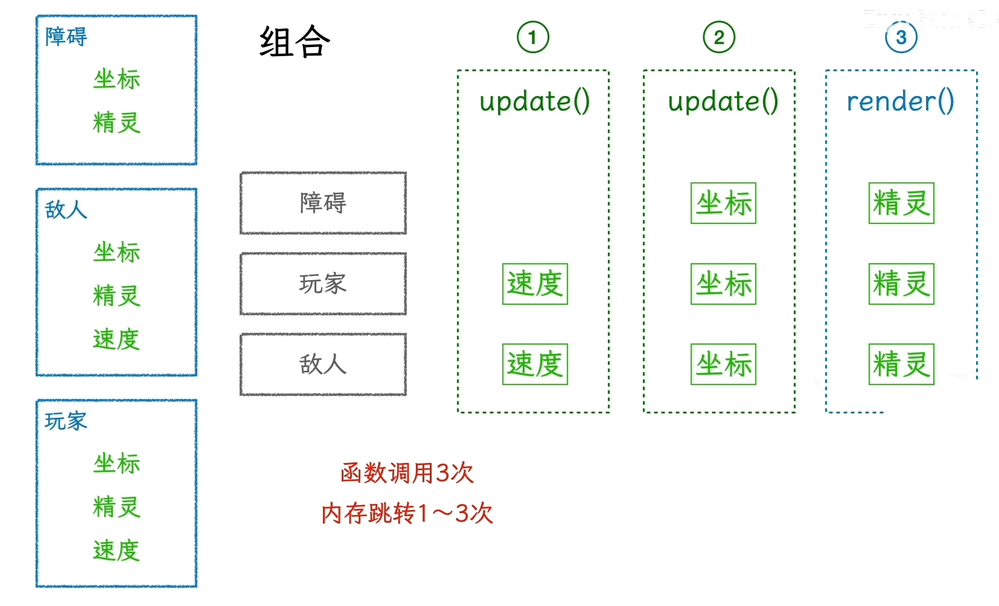


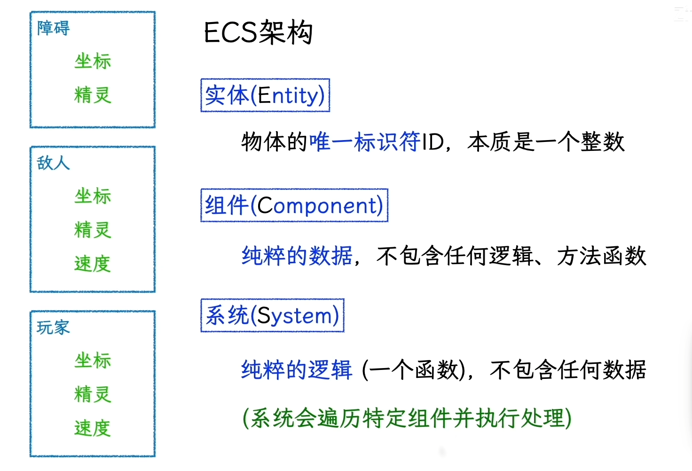

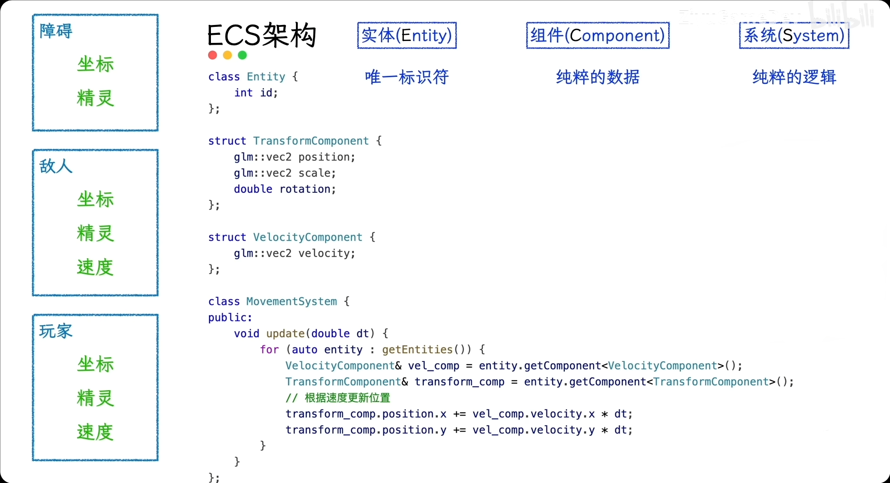

### ECS稀疏集实现

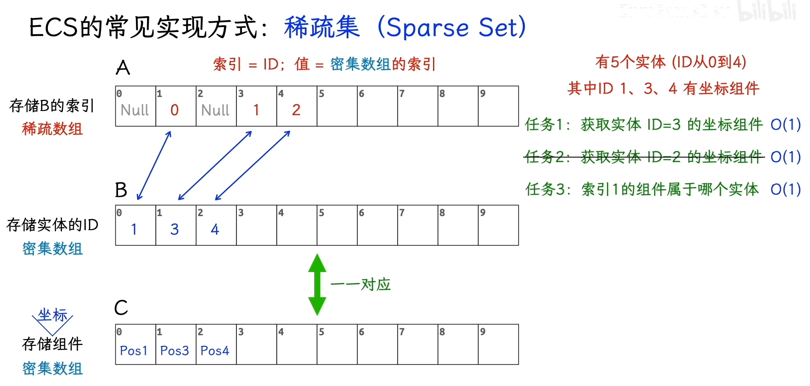


实体ID=3移除坐标组件

1. 在存储[索引=ID，值=密集数组索引]的稀疏数组中，将ID=3的索引值设为无效(比如null)
2. 实体密集数组和坐标组件密集数组索引和最后一个元素交换，然后移除最后一个元素

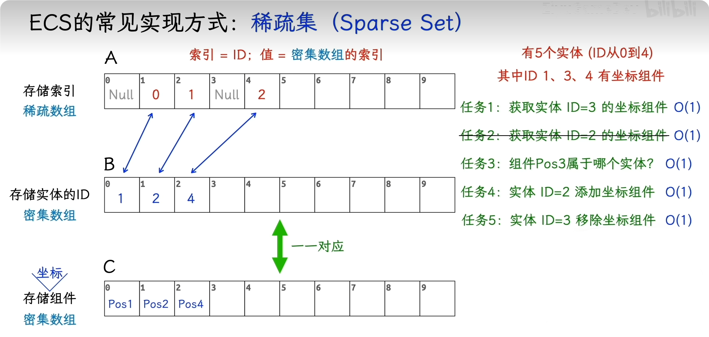


### ECS总结


## UML图

UML(unified modeling language)，统一建模语言，是一种用于软件系统分析和设计的可视化建模语言。


### UML对象和类

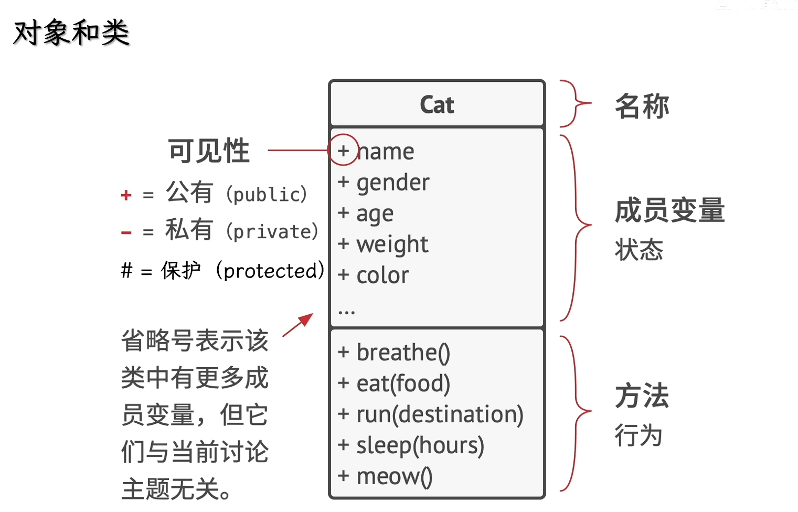

### UML对象间关系

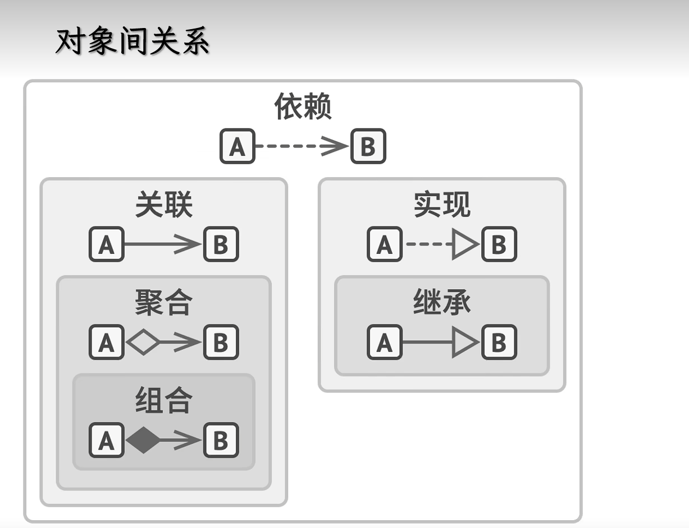

组合：contains-a，整体与部分不可分割，成员变量（并在构造函数中创建）
```C++
// 房间是房屋的一部分。如果房屋被拆了，房间也就不复存在了。
class Room {
    String type;
    Room(String type) { this.type = type; }
}

class House {
    private final Room kitchen; // 组合：生命周期由 House 控制

    House() {
        // 在构造函数内创建，确保 House 拥有 Room 的生命周期
        this.kitchen = new Room("Kitchen");
    }
}

// 组合：直接持有对象或在析构时销毁指针
class House {
    Room kitchen; // 栈上组合：House 销毁，kitchen 自动销毁
    // 或者
    Room* bathroom;
public:
    House() { bathroom = new Room(); }
    ~House() {
        delete bathroom; // 必须手动销毁，体现“生死与共”
    }
};
```

依赖：use-a，临时/瞬时关系，方法参数、局部变量
```C++
class Oxygen { }

class Animal {
    // 只有在呼吸时才需要氧气，是临时的
    public void breathe(Oxygen oxygen) {
        System.out.println("Breathing...");
    }
}
```

关联：links-to，长期引用，平级，成员变量（引用另一个类）
```c++
// 老师和学生是独立的。老师离职了，学生依然在学校里。
class Student {
    String name;
    Student(String name) { this.name = name; }
}

class Teacher {
    // 关联：老师引用了学生，但学生不是老师“创造”出来的
    private List<Student> students;

    // 学生通过外部传入（依赖注入）
    void setStudents(List<Student> s) {
        this.students = s;
    }
}

// 关联：使用指针，指向外部对象
class Teacher {
    Student* student; 
public:
    Teacher(Student* s) : student(s) {}
    ~Teacher() {
        // 析构时不 delete student
        // 因为老师没了，学生还在别的班级
    }
};
```

聚合：has-a，整体与部分可分离，成员变量（通过 Setter 传入）
```C++
public class Department {
    // 聚合：员工是部门的一部分
    private List<Employee> employees;

    public Department(List<Employee> emps) {
        // 员工在部门创建之前就存在（由外部传入）
        this.employees = emps;
    }
    
    // 即使 Department 对象被销毁，传入的 employees 列表依然在外部存在
}
```

实现：is-a，强耦合，类实现接口定义的契约

继承/泛化：Is-a，强耦合，子类是父类的特殊情况，子类可以使用父类的属性和方法，并且可以添加自己的属性和方法。

我们可以按照耦合度(关系的紧密程度)从弱到强对它们进行排序：依赖(use-a) < 关联(links-to) < 聚合(has-a) < 组合(contains-a) < 继承/泛化(is-a) ≈ 实现(is-a)

## SOLID原则

今天，我们将探讨一个更高层次的、类似于“内功心法”的东西——SOLID原则。它是五个面向对象设计原则的缩写，是无数软件工程师智慧的结晶。理解并遵循这些原则，可以帮助我们从根本上写出更健壮、更灵活、更易于维护的代码。

编写优雅健壮代码的五大原则

1. S - Single Responsibility Principle (单一职责原则)
2. O - Open/Closed Principle (开闭原则)
3. L - Liskov Substitution Principle (里氏替换原则)
4. I - Interface Segregation Principle (接口隔离原则)
5. D - Dependency Inversion Principle (依赖倒置原则)

### 单一职责原则

官方定义：一个类，应该只有一个引起它变化的原因。 通俗理解：一个类应该只负责一项功能或任务，保持职责的纯粹性。

1. ✅ 项目中的正面例子：MoveControl 类 在应用组合模式后，我们将移动控制逻辑从 Player 中剥离出来，创建了 MoveControl 类。这个类的职责极其单一：只负责根据输入更新方向状态。它不关心父对象是谁（Player 或 Enemy），也不关心如何渲染。这种设计使得 MoveControl 模块本身非常稳定，修改它不会影响到其他系统。

2. ❌ 项目中有待改进的例子：Game 类 我们的 Game 类是一个典型的“上帝类”，它的职责过于繁多：播放音乐、提供随机数等工具函数、管理场景切换、执行渲染调用等等。理论上，这些功能都应该被拆分到各自独立的模块中（如 AudioManager, RenderManager, SceneManager）。这正是我们未来主线课程中需要继续优化的方向。

### 开闭原则

官方定义：软件实体（类、模块、函数等）应该是可扩展的，但是不可修改的。 通俗理解：当需要添加新功能时，我们应该通过增加新代码来实现，而不是修改旧代码。

1. ✅ 项目中的正面例子：SpellCreator 工厂 在使用工厂方法模式后，我们的 Weapon 持有一个 SpellCreator 的抽象指针。如果想增加一种新的“冰霜法术”，我们不需要修改任何 Weapon 或 SpellCreator 的代码。我们只需要新增一个 IceSpellCreator 类即可。这就是对扩展开放（可以新增Creator），对修改关闭（Weapon类不用动）。

2. ❌ 项目中有待改进的例子：Player 类 当前的 Player 类还不完全符合开闭原则。例如，它有两个固定的武器成员 weapon_ 和 weapon2_。如果想添加第三把武器，就必须修改 Player 的头文件和源文件，增加 weapon3_。更理想的设计是将武器存储在一个容器里（如 std::vector<Weapon*>），这样就可以在不修改 Player 类的情况下，动态地增删武器。

### 里氏替换原则 

官方定义：子类型必须能够替换掉它们的基类型。 通俗理解：在任何使用父类的地方，都应该可以安全地用其子类来替换，而程序的行为不会产生错误或异常。

3. ✅ 项目中的正面例子：Actor 类 Player 和 Enemy 都继承自 Actor。在 HUDStats 中，它的 target_ 指针类型是 Actor*。这意味着，这个UI组件既可以显示 Player 的状态，也可以无缝切换去显示任意一个 Enemy 的状态，因为 Player 和 Enemy 都完全遵循了 Actor 定义的“契约”。

4. ❌ 项目中有待改进的例子：ObjectWorld 与 ObjectScreen 的继承关系 在我们的设计中，ObjectWorld（世界对象）继承自 ObjectScreen（屏幕对象）。这在当时似乎很方便，但它违反了里氏替换原则。Scene 类中有一个 children_screen_ 容器，其设计初衷是存放UI等屏幕元素。但由于继承关系，我们甚至可以把 Player 或 Enemy （它们是 ObjectWorld 的子类）放进这个只应存放屏幕元素的容器里，这显然会破坏程序的逻辑。 更好的设计：ObjectWorld 和 ObjectScreen 不应该有直接的继承关系，而是可以共同继承自一个更底层的基类（比如我们现有的 Object），保持各自继承树的独立性。

### 接口隔离原则

官方定义：客户端不应该被迫依赖于它们不使用的方法。 通俗理解：类的接口应该尽量“小而专”，而不是“大而全”。

1. ✅ 项目中的正面例子：继承树的设计 我们整个项目的继承结构在很大程度上遵循了接口隔离。例如，ObjectAffiliate（附加件）拥有 offset_ 和 size_ 相关的接口，而 ObjectWorld 和 ObjectScreen 则没有，因为它们不需要。反之，ObjectAffiliate 的子类（如Sprite, Collider）也不需要关心世界坐标 position_。这种划分使得每个类的接口都与其自身职责紧密相关。

2. ❌ 项目中有待改进的例子：Scene 类的 saveData/loadData 接口 我们在 Scene 基类中定义了 saveData 和 loadData 虚函数。但并非所有场景都需要存读档功能，比如 SceneTitle 就不需要。这使得 SceneTitle 继承了它根本用不上的接口，增加了开发者的认知负担。 更好的设计：应该将存读档功能定义在一个更具体的接口或类中（例如 ISaveable），然后让真正需要该功能的场景（如SceneMain）去实现它。

### 依赖倒置原则 

官方定义：

高层模块不应该依赖于低层模块。两者都应该依赖于抽象。
抽象不应该依赖于细节。细节应该依赖于抽象。 通俗理解：“面向接口编程，而不是面向实现编程”。

**上层不应该听命于下层，大家都应该听命于规则（接口）**

这个原则是实现许多设计模式（如工厂、策略、观察者）的理论基石。

1. ✅ 项目中的正面例子：Player 与 MoveControl Player（高层模块，关心游戏逻辑）不直接依赖于具体的键盘扫描码（低层模块，实现细节）。它只依赖于 MoveControl 这个抽象接口。而具体的 MoveControl 实现（细节）也依赖于这个抽象接口。这就实现了高层与低层的解耦，两者都依赖于抽象。

2. ❌ 项目中有待改进的例子：Sprite 的渲染 在 Sprite::render 中，我们直接调用了 game_.renderTexture(...)。这里 Sprite（高层模块）直接依赖了 Game 这个具体类（低层模块）的具体实现。如果未来我们想把渲染引擎从 SDL 更换为 OpenGL，就必须修改 Sprite 类的代码。 更好的设计：应该定义一个抽象的 IRenderer 接口，其中包含 renderTexture 方法。Sprite 只依赖于这个接口。然后我们可以创建 SDLRenderer, OpenGLRenderer 等具体实现（细节），并在程序启动时决定使用哪一个。这样，更换渲染引擎将不再需要修改 Sprite 的代码。

## 组合优于继承

虽然不属于 SOLID，但这个原则在现代面向对象设计中至关重要，并且与 SOLID 精神一脉相承。在我们的重构过程中，Weapon 类的演变就是绝佳的例子：它通过组合 SpellCreator 组件，而不是通过继承出 WeaponThunder, WeaponFire 等子类，获得了巨大的灵活性。

## 设计模式

### 总结

#### 创建型模式

解决“怎么造对象”

| 模式 | 是什么 | 什么时候用 |
|------|------|:----:|
| 单例 (Singleton) | 全局只有一个实例，大家都用这一个。 | 这种东西只能有一个（如：配置管理器、线程池、全局日志）。 |
| 原型 (Prototype) | 不用 new，直接从现有的对象克隆一个。 | 创建成本太高（如：查数据库、复杂计算）或者对象种类太多。 |
| 工厂方法 (Factory) | 定义一个创建对象的接口，但让子类决定具体实例化哪个类。| 当需要将对象的创建与使用分离，或者由子类决定创建何种对象时 |
| 生成器 (Builder) | 像点餐一样，分步骤组装复杂对象。| 用于解决复杂对象的创建问题 |
| 对象池 (Object Pool) | 预先造好一堆，用时借，用完还。| 对象频繁创建和销毁导致性能压力大（如：游戏里的子弹、数据库连接）。|

#### 结构型模式

解决“对象怎么组合”

| 模式 | 是什么 | 什么时候用 |
|------|------|:----:|
| 组合 (Composite) | 把整体和部分统一(抽象)看待（树状结构）。 | 需要处理游戏场景，文件夹/文件、UI 树、技能树等具有层级关系的场景。 |
| 外观 (Facade) | 为一组复杂的子系统接口提供一个更高级别的、统一的接口。 | 内部系统太乱太深，需要给外部提供一个一键操作的接口。比如游戏资源管理器 |
| 装饰 (Decorator) | 不改代码，像穿衣服一样给对象套新功能。 | 需要动态给对象加功能 |

#### 行为型模式

解决“对象怎么沟通”

| 模式 | 是什么 | 什么时候用 |
|------|------|:----:|
| 责任链 (Chain of Responsibility) | 一个请求经过一排人处理，谁能处理谁处理。 | 审批流、多级拦截器（如：过滤敏感词、权限检查）。 |
| 模板方法 (Template Method) | 把固定流程写在父类，具体的变动留给子类实现。 | 几个业务逻辑 80% 相同，只有 20% 细节不同（如：各种支付流程）。 |
| 状态 (State) | 对象根据当前状态改变自己的行为。 | 复杂的 if-else 或 switch 切换状态（如：主角在站立、跳跃、受伤时的不同按键反馈）。|
| 策略 (Strategy) | 定义了算法族，分别封装起来，让它们可以互相替换。 | 当有多个算法可以完成某个任务，并且客户端需要动态切换算法时。|
| 命令 (Command) | 把动作打包成订单（对象），支持撤销、重做。 | 需要实现 Ctrl+Z 撤销、排队执行或宏操作。 |
| 观察者 (Observer) | 发布订阅 | 典型的“一变全变”（如：UI 响应数据变化、微信公众号通知）。 |

### 单例模式

1. 私有化构造函数，删除拷贝和赋值：防止外部创建和复制实例。
2. 静态方法获取实例：通过静态方法返回单例实例，确保全局唯一。
3. 静态成员变量：存储单例实例，确保全局唯一。
4. 线程安全：考虑多线程环境下的实例化问题，确保只有一个实例被创建。
5. 延迟加载：在需要时才创建实例，避免资源浪费。
   
```C++
#include <iostream>

/**
 * Singleton 类实现了单例模式。
 * 1. 私有化构造函数，防止外部实例化。
 * 2. 静态方法 getInstance() 提供全局访问点。
 * 3. 使用 C++11 静态局部变量特性确保线程安全和延迟加载。
 */
class Singleton {
public:
    // 1. 删除拷贝构造函数和赋值操作符，防止实例被复制
    Singleton(const Singleton&) = delete;
    Singleton& operator=(const Singleton&) = delete;

    /**
     * 2. 获取单例实例的静态方法
     * @return 返回单例实例的引用
     */
    static Singleton& getInstance() {
        // 3 & 4 & 5. 静态局部变量：
        // - 延迟加载：只有在第一次调用 getInstance 时才会被初始化。
        // - 线程安全：C++11 标准 (Section 6.7) 保证了多线程环境下静态局部变量初始化的安全性。
        //   编译器会自动处理同步逻辑，因此不需要显式的 std::mutex。
        static Singleton instance;
        return instance;
    }

    // 一个示例成员函数
    void doSomething() {
        std::cout << "Singleton is working (Instance Address: " << this << ")" << std::endl;
    }

private:
    // 1. 私有构造函数
    Singleton() {
        std::cout << "Singleton Instance Created." << std::endl;
    }

    // 私有析构函数
    ~Singleton() {
        std::cout << "Singleton Instance Destroyed." << std::endl;
    }
};

int main() {
    std::cout << "--- Program Start ---" << std::endl;

    // 第一次调用，触发实例创建
    Singleton& s1 = Singleton::getInstance();
    s1.doSomething();

    // 第二次调用，直接获取已存在的实例
    Singleton& s2 = Singleton::getInstance();
    s2.doSomething();

    // 验证地址是否相同
    if (&s1 == &s2) {
        std::cout << "Both s1 and s2 point to the same instance." << std::endl;
    }

    std::cout << "--- Program End ---" << std::endl;

    return 0;
}
```

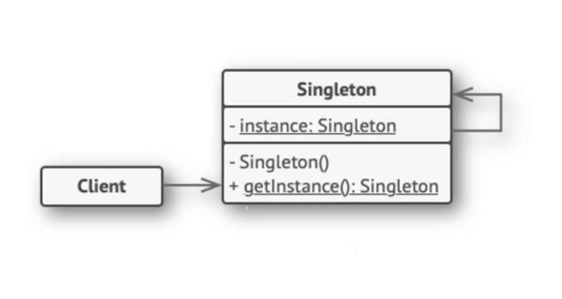

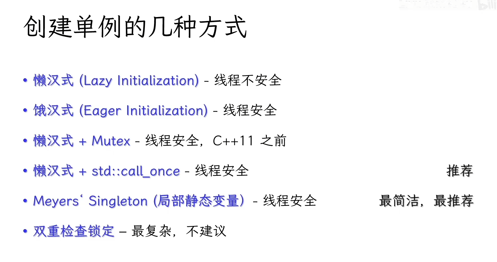

### 组合模式

我的理解：**“组合即抽象”且“对使用透明”**

组合模式的精髓在于，它允许我们将对象组合成树形结构，并且可以用同样的方式去对待单个对象（叶子节点）和对象组合（树枝节点）。

无论你操作的是"叶子节点"（单个对象）还是"树枝节点"（包含子对象的组合对象），都可以用完全一样的代码来调用它们的方法，无需区分类型。

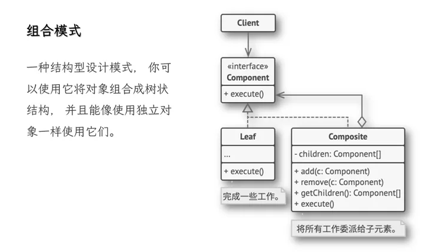

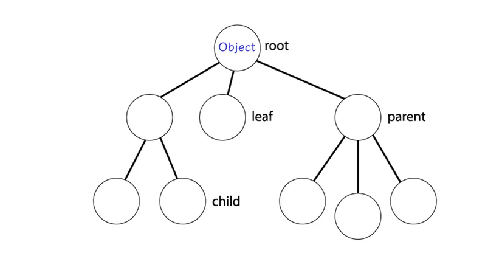

我们游戏引擎中的场景图 (Scene Graph) 就是一个天然的组合模式实现：

1. Scene 是根节点。
2. Player, Enemy 等是 Scene 的子节点（可以看作是树枝）。
3. Sprite, Collider 是 Player 的子节点（可以看作是叶子）。
4. 调用 scene->update() 时，Scene 会遍历并调用所有子对象的 update()，子对象又会调用它自己的子对象的 update()... 这样，无论是复杂的 Player 还是简单的 Sprite，都被 update() 这一操作统一处理了。

这次重构，我们将利用这种思想，将“移动控制”这个功能，从 Player 内部剥离出来，做成一个独立的、可插拔的“零件”对象。

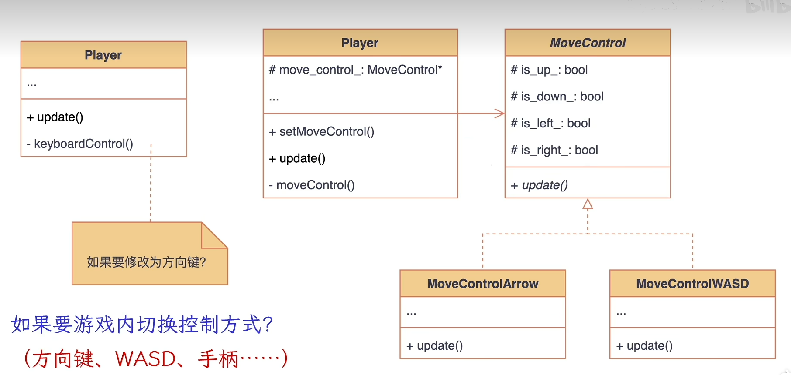

步骤 1: 创建抽象的 MoveControl 基类

首先，我们定义一个“移动控制”零件的通用接口。它需要继承自 Object，这样它才能被加入到我们的场景图中。

```C++
// src/raw/move_control.h
#ifndef MOVE_CONTROL_H
#define MOVE_CONTROL_H

#include "../core/object.h"

class MoveControl : public Object
{
protected:
    // 这四个布尔值是所有具体控制方式都需要提供的状态
    bool is_up_ = false;
    bool is_down_ = false;
    bool is_left_ = false;
    bool is_right_ = false;

public:
    // 提供统一的接口，让外部（Player）查询状态
    bool isUp() const { return is_up_; }
    bool isDown() const { return is_down_; }
    bool isLeft() const { return is_left_; }
    bool isRight() const { return is_right_; }
};

#endif // MOVE_CONTROL_H
```

步骤 2: 创建具体的控制类

```C++
// WASD控制器
// src/move_control_wasd.cpp
#include "move_control_wasd.h"

void MoveControlWASD::update(float dt)
{
    MoveControl::update(dt);
    auto keyboard = SDL_GetKeyboardState(NULL);
    is_up_ = keyboard[SDL_SCANCODE_W];
    is_down_ = keyboard[SDL_SCANCODE_S];
    is_left_ = keyboard[SDL_SCANCODE_A];
    is_right_ = keyboard[SDL_SCANCODE_D];
}

// 方向键控制器：
// src/move_control_arrow.cpp
#include "move_control_arrow.h"

void MoveControlArrow::update(float dt)
{
    MoveControl::update(dt);
    auto keyboard = SDL_GetKeyboardState(NULL);
    is_up_ = keyboard[SDL_SCANCODE_UP];
    is_down_ = keyboard[SDL_SCANCODE_DOWN];
    is_left_ = keyboard[SDL_SCANCODE_LEFT];
    is_right_ = keyboard[SDL_SCANCODE_RIGHT];
}
```

步骤 3: 改造 Player 类，让它“组合”一个 MoveControl

最后，我们来改造 Player。它不再关心具体的按键，而是持有一个 MoveControl 的指针，并将移动控制的任务委托给它。

```C++
// src/player.h (关键改动)
class Player : public Actor
{
protected:
    MoveControl* move_control_ = nullptr;
    // ...

public:
    // 提供一个方法来切换控制方式
    void setMoveControl(MoveControl* move_control);

private:
    // 原来的 keyboardControl() 变成了 moveControl()
    void moveControl();
    // ...
};

// src/player.cpp (关键改动)
void Player::init()
{
    // ...
    // 默认使用WASD控制，并将其作为子对象添加到Player中
    move_control_ = new MoveControlWASD();
    addChild(move_control_);
}

// 核心：Player不再自己检查键盘，而是询问 move_control_ 组件
void Player::moveControl()
{
    if (move_control_ == nullptr) return;
    if (move_control_->isUp()){
        velocity_.y = -max_speed_;
    }
    if (move_control_->isDown()){
        velocity_.y = max_speed_;
    }
    // ... Left and Right
}

// 允许在运行时动态地更换“零件”
void Player::setMoveControl(MoveControl *move_control)
{
    if (move_control_ != nullptr) {
        // 标记旧的组件需要被移除
        move_control_->setNeedRemove(true);
    }
    move_control_ = move_control;
    // 将新的组件作为子对象添加进来
    safeAddChild(move_control);
}

// 在事件处理中，增加切换逻辑
bool Player::handleEvents(SDL_Event& event)
{
    if (Actor::handleEvents(event)) return true;
    // 按C键切换WASD，按V键切换箭头
    if (event.type == SDL_EVENT_KEY_DOWN)
    {
        if (event.key.scancode == SDL_SCANCODE_C) setMoveControl(new MoveControlWASD());
        if (event.key.scancode == SDL_SCANCODE_V) setMoveControl(new MoveControlArrow());
        return true;
    }
    return false;
}

```

总结：我们得到了什么？

通过这次重构，我们的代码质量得到了显著提升：

1. 高内聚，低耦合：Player 和 MoveControl 各司其职。Player 不再依赖于具体的键盘扫描码，MoveControl 也不需要知道 Player 的存在。
2. 灵活性与扩展性：现在，想增加手柄支持？只需要创建一个 MoveControlGamepad 类，在 handleEvents 里加一个切换按键即可。Player 的代码一行都不用改！
3. 组合优于继承：我们没有创建 PlayerWASD 和 PlayerArrow 这样的子类，而是通过给 Player "插上"不同的 MoveControl 组件来改变其行为。这种组合的方式比继承要灵活得多，避免了类爆炸的问题。
   
### 责任链模式

责任链模式的核心思想：将请求的发送者和接收者解耦，让多个对象都有机会处理这个请求，并将这些对象连成一条链，沿着这条链传递该请求，直到有一个对象处理它为止。

当前代码的问题在哪里？

在上一课中(组合模式)，我们成功地将移动控制逻辑封装到了 MoveControl 类中，这是一个巨大的进步。但是，事件处理的流程仍然不够理想：

1. 控制权不够灵活：MoveControl 只是一个被动的状态容器。它自己不处理输入，而是由 Player::handleEvents 来读取键盘状态，并调用 setMoveControl 来切换实例。Player 仍然是输入处理的“决策中心”。
2. 责任不够下放：我们希望 MoveControl 成为一个完全独立的组件，它应该自己负责处理输入事件，并直接影响其父对象（Actor）的状态。Player 不应该关心 MoveControl 的内部实现。
3. 潜力未被挖掘：既然“移动控制”已经是一个独立的组件，为什么只有 Player 能拥有它？如果一个 Enemy 也能拥有这个组件，会怎么样？我们当前的设计将 move_control_ 成员放在 Player 中，限制了这种可能性。

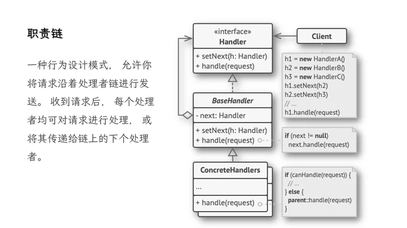

责任链模式的思想其实很简单：当一个请求（在我们的游戏中，就是一个事件，如键盘按下、鼠标点击）发生时，你把它交给一个对象链中的第一个对象。这个对象看看自己能不能处理，如果能，就处理掉，流程结束；如果不能，它就把这个请求传递给链上的下一个对象。这个过程持续下去，直到请求被处理，或者传递到链的末尾。

现实世界类比：想象一下公司的审批流程。你提交一份报销单，首先由你的直属经理审批（链的第一环），如果金额超出他的权限，他就会把报销单上交给他/她的上级（链的第二环），以此类推，直到找到有足够权限的管理者签字为止。

在我们的游戏中，场景图（Scene Graph） 就是一条天然的责任链！

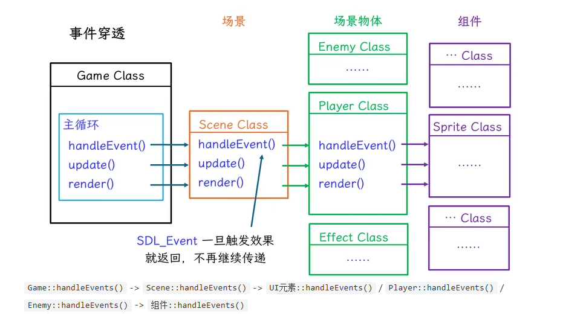


一个鼠标点击事件传来，Scene 首先把它交给最上层的UI元素（比如暂停按钮）。

1. 如果暂停按钮发现点击位置在自己范围内，它就处理这个事件（暂停游戏），并返回 true，表示“事件已被处理”，事件传递就此中断。
2. 如果按钮发现点击位置不在自己范围内，它就返回 false，Scene 就会继续把这个事件交给下一个对象（比如玩家 Player），让它来判断。

这就是利用树形组合结构实现的责任链。

重构实战：打造“可附身”的控制权

步骤 1: 强化 MoveControl，使其成为主动的事件处理器

我们不再让 Player 管理输入，而是让 MoveControl 自己监听并处理键盘事件，并直接更新其父对象的速度。

```C++
// src/raw/move_control.h (关键改动)
class Actor; // 前向声明
class MoveControl : public Object
{
protected:
    // ...
    Actor* parent_ = nullptr; // 需要一个指向父对象的指针来施加影响
    float max_speed_ = 500.0f;

public:
    void update(float dt) override;
    virtual bool handleEvents(SDL_Event& event) override; // 拥有自己的事件处理函数！

    // ... setters and getters
    void setParent(Actor* actor) { parent_ = actor; }
};

// src/raw/move_control.cpp (关键改动)
#include "move_control.h"
#include "../core/actor.h"

// 在 update 中直接影响父节点
void MoveControl::update(float dt)
{
    if (parent_ == nullptr) return;
    Object::update(dt);
    // 速度衰减和施加新的速度，现在是 MoveControl 的责任
    parent_->setVelocity(parent_->getVelocity() * 0.9f);
    auto direction = glm::vec2(is_right_ - is_left_, is_down_ - is_up_);
    if (glm::length(direction) > 0.1f) direction = glm::normalize(direction);
    if (glm::length(direction) > 0.1f) parent_->setVelocity(direction * max_speed_);
}

// 真正处理键盘事件的地方
bool MoveControl::handleEvents(SDL_Event &event)
{
    if (event.type == SDL_EVENT_KEY_DOWN){
        if (event.key.scancode == SDL_SCANCODE_W) is_up_ = true;
        // ... 其他按键
        return true; // 消耗掉事件
    }
    if (event.type == SDL_EVENT_KEY_UP){
        if (event.key.scancode == SDL_SCANCODE_W) is_up_ = false;
        // ... 其他按键
        return true; // 消耗掉事件
    }
    return false; // 如果不是我关心的事件，就返回 false，让链上的其他对象处理
}
```

通过这个改动，MoveControl 从一个数据容器，蜕变成了一个功能完整的、独立的事件处理单元。

步骤 2: 提升 MoveControl 的通用性

为了让任何 Actor（无论是 Player 还是 Enemy）都能被控制，我们将 move_control_ 成员从 Player 类提升到其父类 Actor 中。

```C++
// src/core/actor.h
class Actor : public ObjectWorld
{
protected:
+   MoveControl* move_control_ = nullptr; // 移动控制
    Stats *stats_ = nullptr; // 角色属性
    // ...
public:
    // ...
+   void removeMoveControl();
+   MoveControl* getMoveControl() const { return move_control_; }
+   void setMoveControl(MoveControl *move_control);
};
```

现在，setMoveControl 成为了所有 Actor 的通用能力。

步骤 3: 实现“控制权转移”

这是最激动人心的部分！我们在 Spawner（怪物生成器）里增加一个逻辑：每当新一波敌人生成时，将控制权从玩家身上剥离，并赋予给新生成的第一个敌人！

```C++
// src/spawner.cpp
void Spawner::update(float dt)
{
    // ... (计时和生成逻辑)
    for (int i = 0; i < num_; i++)
    {
        // ... (创建 enemy)
        Effect::addEffectChild(Game::getInstance().getCurrentScene(), "assets/effect/184_3.png", pos, 1.0f, enemy);
        
        // 核心：控制权转移！
        if (i == 0){
            // 1. 给第一个新生成的敌人装上“移动控制”组件
            enemy->setMoveControl(new MoveControl());
            // 2. 移除玩家身上的“移动控制”组件
            target_->removeMoveControl();
        }
    }
}
```

同时，我们让 Player 在失去控制权后，执行 autoEscape 逻辑（目前为空，但为未来的AI行为留下了接口）。

```C++
// src/player.cpp
void Player::update(float dt)
{
    Actor::update(dt);
-   velocity_ *= 0.9f;
-   moveControl();
+   if (!move_control_) autoEscape(); //如果没有移动控制，则自动逃跑
    checkState();
    move(dt);
    syncCamera();
    checkIsDead();
}
```

现在运行游戏，你会发现一个全新的玩法：游戏开始时你可以控制主角，但一旦第一波怪物刷新，你的控制权就会被“附身”到其中一个幽灵身上！你将扮演幽灵去追杀之前的主角。


总结

通过应用责任链模式，我们获得了巨大的收益：

1. 完全解耦：事件的发送者（Game主循环）完全不知道谁会处理这个事件。它只是把事件投入到场景图这条“责任链”中。
2. 高度灵活：我们可以在运行时动态地修改这条链，比如把处理事件的责任（MoveControl组件）从一个对象（Player）转移到另一个对象（Enemy），从而创造出新颖的游戏机制。
3. 职责清晰：每个对象（Scene, UI, MoveControl）都只关心自己能处理的事件，不能处理的就传递下去。这让每个类的代码都更加简洁和专注。

责任链模式是构建可扩展、数据驱动的输入系统和UI系统的基石。掌握它，你就能创造出更丰富、更有趣的交互体验。

### 模板方法模式

1. 理解模板方法模式的核心思想：在一个方法中定义一个算法的骨架，而将一些步骤的实现延迟到子类中。
2. 掌握控制反转 (Inversion of Control) 的概念，也称“好莱坞原则”。
3. 分析从 main() 函数驱动到 SDL3 回调驱动的转变，理解其背后蕴含的模板方法思想。

让我们回顾一下到目前为止我们的游戏主循环，它位于 Game::run() 方法中：

```C++
// src/core/game.cpp (旧代码)
void Game::run()
{
    while (is_running_){
        // 1. 计算帧率
        auto start = SDL_GetTicksNS();
        
        // 2. 检查场景切换
        if (next_scene_){ /* ... */ }

        // 3. 处理所有事件
        handleEvents();

        // 4. 更新游戏状态
        update(dt_);

        // 5. 渲染画面
        render();

        // 6. 控制帧率
        auto end = SDL_GetTicksNS();
        // ... (帧延迟计算)
    }
}
```

这个 run() 方法是我们游戏的心脏，它定义了游戏运行的完整流程。这种方式虽然直观，但也存在一个设计上的问题：

我们的 Game 类，与一个特定的“游戏循环”实现方案紧紧地绑定在了一起。

Game 类不仅要负责游戏逻辑的 update 和 render，还要负责非常底层的循环控制、事件轮询 (SDL_PollEvent) 和帧率计算。如果 SDL 未来提供了一种更高效、更现代的循环方式（剧透：它确实提供了），我们要想采用，就必须重写整个 run() 方法。

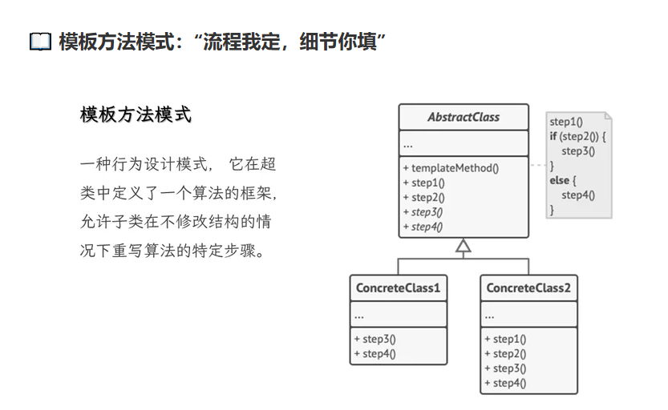

模板方法模式的核心思想非常简单，就像填写一份预设好格式的表格：

在一个基类中定义好一个算法的整体骨架（流程），但允许子类在不改变这个骨架的前提下，重写算法中的某些特定步骤。

现实世界类比：想象一下去一家自助餐厅。餐厅规定了你的就餐流程（模板方法）：

1. 取餐盘 (固定步骤)
2. 选择菜品 (可变步骤 - 你可以选沙拉、热菜或甜点)
3. 结账 (固定步骤)
4. 找座位就餐 (固定步骤)
5. 餐厅（基类）定义了整个流程的骨架，但“选择菜品”这个具体步骤的实现则由你（子类）来决定。你不能打乱这个流程（比如先吃再结账），但可以在流程的特定环节上“做文章”。

重构实战：拥抱 SDL3 的“模板”

现在，我们将游戏的主循环从我们自己写的 while 循环，切换到由 SDL3 框架提供的、基于回调的生命周期管理。这个过程，正是对模板方法模式的一次经典应用。

在这里：

1. “基类” 的角色由 SDL3 框架扮演。
2. “模板方法” 是 SDL3 内部隐藏的、我们看不见的应用程序主循环。
3. “子类” 的角色由我们的 main.cpp 扮演，我们负责填充模板中预留的“空白步骤”。

步骤 1: 移除我们自己的 run() 循环

首先，我们将 Game::run() 方法以及相关的帧率计算成员变量注释掉。我们不再自己控制游戏循环了。

```C++
// src/core/game.h
class Game {
    // ...
-   Uint64 FPS_ = 60; // 游戏帧率
-   Uint64 frame_delay_ = 0; // 帧延迟，单位ns
-   float dt_ = 0.0f; // 帧间隔
    // ...
public:
-   void run(); // 运行游戏, 执行游戏主循环
};
```

这个改动意味着，我们的 Game 类将变得更加纯粹，只负责 init, handleEvents, update, render, clean 这些具体的游戏逻辑，而不再关心它们何时以及如何被调用。

步骤 2: 在 main.cpp 中“填空”

接下来，我们在 main.cpp 中使用 SDL3 的回调机制，来“填上” SDL3 应用程序生命周期这个“模板”的空白。

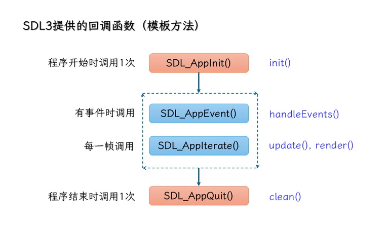

```C++
// src/main.cpp (新代码)
#define SDL_MAIN_USE_CALLBACKS 1 // 告诉SDL我们将提供回调函数

#include "core/game.h"
#include <SDL3/SDL_main.h>

/* 【步骤一：初始化】此函数在启动时运行一次。 */
SDL_AppResult SDL_AppInit(void **appstate, int argc, char *argv[])
{
    Game::getInstance().init("GhostEscape", 1280, 720);
    return SDL_APP_CONTINUE;
}

/* 【步骤二：事件处理】此函数在发生新事件时运行。 */
SDL_AppResult SDL_AppEvent(void *appstate, SDL_Event *event)
{
    if (event->type == SDL_EVENT_QUIT) return SDL_APP_SUCCESS;
    
    Game::getInstance().handleEvents(*event); // 将单个事件交给Game处理
    return SDL_APP_CONTINUE;
}

/* 【步骤三：主循环迭代】此函数每帧运行一次。*/
SDL_AppResult SDL_AppIterate(void *appstate)
{
    // 帧率控制由SDL的模板来完成
    // ... (dt 计算)

    Game::getInstance().update(dt);
    Game::getInstance().render();

    // 检查游戏是否需要退出
    if (Game::getInstance().getIsRunning() == false) return SDL_APP_SUCCESS;

    return SDL_APP_CONTINUE;
}

/* 【步骤四：退出清理】此函数在程序关闭时运行一次。 */
void SDL_AppQuit(void *appstate, SDL_AppResult result)
{
    Game::getInstance().clean();
}
```

这个转变，就是典型的控制反转 (Inversion of Control, IoC)。

1. 之前：是我们的 Game::run() 主动调用 SDL 的函数来检查事件。
2. 现在：是我们把自己的函数 (SDL_AppInit, SDL_AppEvent 等) 注册给 SDL 框架，由 SDL 框架在合适的时机来回调我们的函数。

好莱坞原则

这就是著名的“好莱坞原则”：“Don't call us, we'll call you.”（不要给我们打电话，我们会打给你）。你（你的代码）不必主动去调用框架，只需要把你的能力告诉框架，框架会在需要的时候来“找”你。

总结

通过本次对模板方法模式的探讨，我们学到了：

1. 关注点分离：该模式让框架（或基类）专注于算法的稳定流程，让使用者（或子类）专注于具体步骤的个性化实现。SDL 负责高效的循环和事件分发，我们则专注于游戏本身 update 和 render 的内容。
2. 代码复用与扩展性：算法的骨架被固定下来，在所有子类中复用。当我们需要为不同的平台（如移动端）编写程序时，可能只需要提供不同的“填空”实现，而无需关心主循环的差异。
3. 框架设计的基石：模板方法是构建健壮框架的基石。它定义了框架的“规矩”，使用者只需要按照规矩填空，就能快速、安全地构建功能。

### 原型模式

简单来说，原型模式（Prototype Pattern） 的核心思想就是：“克隆”优于“创建”。

想象一下你在写代码时，需要一个复杂的对象。通常你会用 new 关键字去创建一个新实例，然后一步步设置它的属性。但如果这个对象初始化非常麻烦（比如要查数据库、循环计算一万次），直接复刻一个已经存在的对象，显然比从头再造一个要快得多。

1. 理解原型模式的核心思想：通过复制一个现有的实例（原型）来创建新的对象，而不是通过 new 关键字和构造函数。
2. 掌握如何在 C++ 中实现 clone() 方法来支持原型模式。
3. 应用原型模式，将 Weapon 和 Spell 的创建过程解耦，实现数据驱动的武器配置。

当前代码的问题在哪里？

在之前的版本中，我们虽然将 Weapon 和 MoveControl 进行了组件化，但仍然存在一些僵化设计：

1. 武器类型僵化：我们有一个通用的 Weapon 基类和一个具体的 WeaponThunder 子类。这意味着每当我们想创造一种新武器（比如火球、冰霜），就必须创建一个新的 C++ 子类。这会导致类爆炸，并且很不灵活。
2. 创建过程耦合：在 WeaponThunder 的攻击逻辑中，我们是这样创建法术的：Spell::addSpellChild(nullptr, "assets/effect/Thunderstrike...", ...)。这使得 WeaponThunder 必须知道创建雷电法术所3需的所有参数（贴图路径、伤害值、大小等）。如果法术的构造函数改变了，所有使用它的武器类都得跟着改。

我们理想中的系统应该是：Weapon 类不关心它发射的是什么法术，它只负责“在某个时机，在某个位置，发射一个法术”。法术“长”什么样，有什么效果，应该由法术自己决定。

```go
func (w *WeaponThunder) HandleEvent(event *sdl.Event) {
	w.Weapon.HandleEvent(event)
	// 处理攻击事件
	if event.Type() == sdl.EventMouseButtonDown {
		if event.Button().Button == uint8(sdl.ButtonLeft) {
			if w.CanAttack() {
				w.Game().PlaySound("assets/sound/big-thunder.mp3", false)
				pos := core.GetInstance().GetMousePosition().Add(core.GetInstance().GetCurrentScene().GetCameraPosition())
				spell := world.AddSpellChild(nil, "assets/effect/Thunderstrike w blur.png", pos, 40.0, 3.0, core.AnchorTypeCenter)
				// 攻击
				w.Attack(pos, spell)
			}
		}
	}
}

func (w *Weapon) Attack(pos mgl32.Vec2, spell *world.Spell) {
	if spell == nil {
		return
	}
	w.Parent.GetStats().UseMana(w.ManaCost)
	w.CooldownTimer = 0.0
	spell.SetPosition(pos)
	core.GetInstance().GetCurrentScene().AddChild(spell)
}
```

原型模式正是为了解决上述问题。它的核心是让一个“原型”对象实现一个 clone() 方法，这个方法能够返回一个与自己一模一样的新对象。

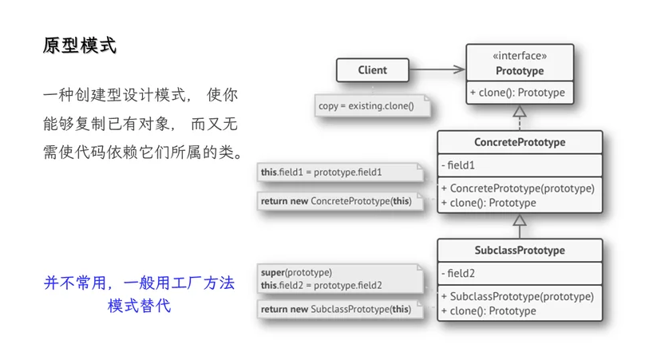

步骤 1: 让 Spell 能够“克隆”自己

我们在 Spell 类中添加一个 clone() 方法。这个方法会调用 addSpellChild 静态函数，并使用自身已有的属性（如图纸路径、伤害、大小）来创建一个全新的、一模一样的 Spell 实例。

```C++
// src/world/spell.h
class Spell : public ObjectWorld
{
protected:
    std::string file_path_; // 保存这些变量是为了克隆
    float scale_ = 1.0f;
    // ...
public:
    Spell* clone();
    // ...
};

// src/world/spell.cpp
Spell *Spell::clone()
{
    // 调用静态创建函数，用自己的属性来创建一个副本
    return addSpellChild(
        Game::getInstance().getCurrentScene(), 
        file_path_, 
        getPosition(), 
        damage_, 
        scale_, 
        sprite_->getAnchor()
    );
}
```

步骤 2: 改造 Weapon，让它持有“法术原型”

我们现在可以移除 WeaponThunder 这个子类了，让 Weapon 变成一个通用的、可配置的类。它的核心改动是：不再关心具体的法术创建，而是持有一个 Spell* 成员，我们称之为 spell_prototype_。

```C++
// src/raw/weapon.h
class Weapon : public Object
{
protected:
    Actor* parent_ = nullptr;
    Spell* spell_prototype_ = nullptr; // 持有一个法术原型！
    // ...
public:
    void attack(glm::vec2 position);
    // ... getters and setters
    void setSpellPrototype(Spell* spell) { spell_prototype_ = spell; }
};
```

步骤 3: 在攻击时“克隆”原型

现在，Weapon 的攻击逻辑变得极其简单和通用。它不需要知道法术的任何细节，只需要调用原型对象的 clone() 方法，然后设置新克隆出来法术的位置即可。

```C++
// src/raw/weapon.cpp
void Weapon::attack(glm::vec2 position)
{
    if (!spell_prototype_ || !canAttack()) return;
    
    // ... (处理冷却和法力消耗)

    // 关键：不再是 new Spell()，而是 clone()！
    auto spell = spell_prototype_->clone();
    spell->setPosition(position);
    // clone() 内部已经将 spell 添加到场景中了
}
```

步骤 4: 在 Player 中“配置”武器

最后，我们在 Player::init() 中完成武器的“组装”。我们先创建一个“雷电法术”的实例，但不激活它（setActive(false)），让它成为一个隐藏的“原型”。然后，我们把这个原型交给 Weapon。

```C++
// src/player.cpp
void Player::init()
{
    // ...
    // 创建一个通用的 Weapon 组件
    weapon_ = Weapon::addWeaponChild(this, 2.0f, 40.0f);

    // 创建一个法术原型，并隐藏它
    auto spell_prototype = Spell::addSpellChild(
        Game::getInstance().getCurrentScene(), 
        "assets/effect/Thunderstrike w blur.png", 
        glm::vec2(0), 40.0f, 3.0f, Anchor::CENTER
    );
    spell_prototype->setActive(false);

    // 将原型“安装”到武器上
    weapon_->setSpellPrototype(spell_prototype);
    // ...
}
```

至此，我们完成了第一步重构。Weapon 和 Spell 成功解耦！Weapon 现在是一个通用的发射器，它可以发射任何支持 clone() 方法的 Spell 对象。

第二步：利用原型模式实现武器多样性

原型模式的威力不止于此。它让我们能够通过配置数据而非编写代码来创造多样性。现在，我们来给玩家添加第二把武器——火球术，而**无需创建任何新的 C++ 类。**

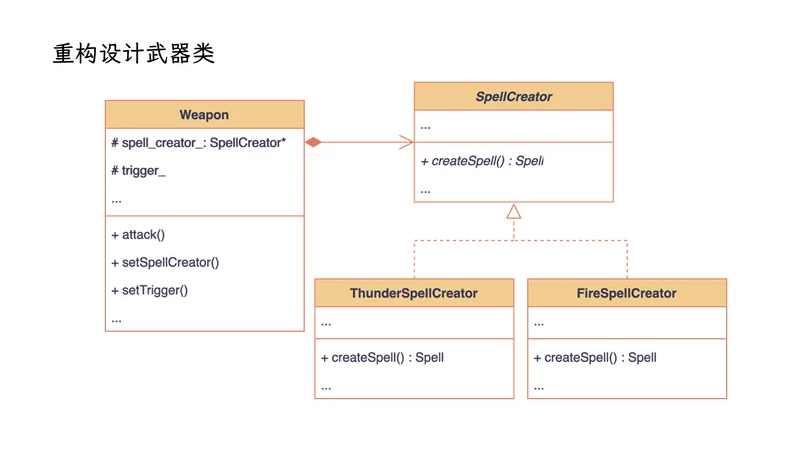

步骤 1: 升级 clone() 接口

为了让克隆成为一种通用能力，我们可以在基类 ObjectWorld 中定义一个虚函数 clone()。这样，任何继承自 ObjectWorld 的对象都有了“可克隆”的潜力。

```c++
// src/core/object_world.h
class ObjectWorld : public ObjectScreen
{
public:
    // ...
+   virtual ObjectWorld* clone() { return nullptr; } // 需要用到clone的子类进行重写
};

// src/world/spell.h
class Spell : public ObjectWorld
{
public:
    // ...
-   Spell* clone();
+   virtual Spell* clone() override;
};
```

步骤 2: 在 Player 中配置第二把武器

这步操作和配置第一把武器几乎完全一样，只是使用了不同的资源和参数。

```c++
// src/player.cpp
void Player::init()
{
    // ... (第一把武器的配置不变)

    // 配置第二把武器 (weapon2_)
    weapon2_ = Weapon::addWeaponChild(this, 1.0f, 10.0f); // 不同的CD和蓝耗

    // 创建一个新的“火球”法术原型
    auto spell_prototype2 = Spell::addSpellChild(
        Game::getInstance().getCurrentScene(), 
        "assets/effect/Explosion 2 SpriteSheet.png", // 不同的贴图
        glm::vec2(0), 20.0f, 3.0f, Anchor::CENTER
    );
    spell_prototype2->setActive(false);

    // 将新原型安装到第二把武器上
    weapon2_->setSpellPrototype(spell_prototype2);
    weapon2_->setSoundPath("assets/sound/fire-magic-6947.mp3"); // 不同的音效
    weapon2_->setTriggerButton(SDL_BUTTON_MIDDLE); // 不同的触发键（鼠标中键）
}
```

看！我们仅仅是通过调用 setter 函数，传入不同的数据（贴图、音效、CD、触发键），就“创造”出了一把全新的武器。这就是数据驱动设计的魅力。

总结

通过应用原型模式，我们的武器系统发生了质的飞跃：

1. 告别类爆炸：我们不再需要为每一种武器和法术组合创建新的子类。一个通用的 Weapon 类和一个通用的 Spell 类就足够了。
2. 配置极其灵活：武器的所有属性——它发射的法术、音效、冷却时间、触发方式——都可以在运行时动态配置。这些配置信息甚至可以从外部文件（如 JSON 或 XML）中读取，让策划人员不碰代码就能设计新武器！
3. 真正的解耦：Weapon 彻底从 Spell 的构建细节中解放出来。它只与 Spell 的 clone() 接口交互，符合“面向接口编程”的原则。

原型模式是游戏开发中实现可配置性和内容多样性的强大工具，尤其适用于需要大量创建相似但又略有不同的对象的场景，如子弹、敌人、技能特效等。

### 工厂方法模式

1. 理解工厂方法模式的核心思想：定义一个用于创建对象的接口，但让子类决定实例化哪一个类。
2. 学习如何将对象的创建逻辑从使用者代码中分离出来，封装到专门的“工厂”类中。
3. 对比工厂方法与原型模式，理解它们在不同场景下的优缺点。

当前代码的问题在哪里？

在上一课中，我们使用原型模式成功地将 Weapon 和 Spell 解耦。Player::init() 负责创建并配置一个“法术原型”，然后将其交给 Weapon。Weapon 在攻击时只需要克隆这个原型即可。

这已经很不错了，但仍然存在一个不够优雅的地方：

Player::init() 方法知道得太多了！

```C++
// src/player.cpp (旧代码)
void Player::init()
{
    // ...
    // Player 必须知道创建雷电法术的所有细节
    auto spell_prototype = Spell::addSpellChild(Game::getInstance().getCurrentScene(), "assets/effect/Thunderstrike w blur.png", glm::vec2(0), 40.0f, 3.0f, Anchor::CENTER);
    weapon_->setSpellPrototype(spell_prototype);

    // Player 也必须知道创建火球法术的所有细节
    auto spell_prototype2 = Spell::addSpellChild(Game::getInstance().getCurrentScene(), "assets/effect/Explosion 2 SpriteSheet.png", glm::vec2(0), 20.0f, 3.0f, Anchor::CENTER);
    weapon2_->setSpellPrototype(spell_prototype2);
    // ...
}
```

Player 本应该只关心玩家自身的逻辑，但现在它却成了配置各种法术的“大杂烩”。如果游戏中有几十种法术，Player::init() 方法将会变得异常臃肿和混乱。这违反了**单一职责原则。**

我们需要一种方法，将“如何创建某个特定法术”这个具体的知识，从 Player 中抽离出去。

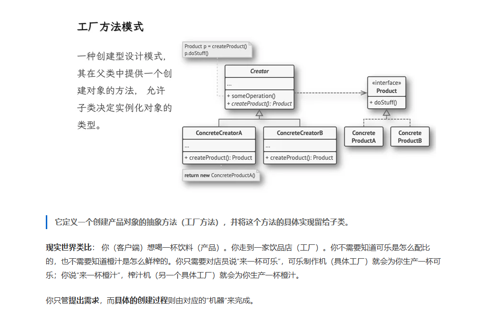

重构实战：为每种法术建立专属“工厂”

步骤 1: 定义一个抽象的“法术工厂”接口

我们首先创建一个 SpellCreator 接口（抽象基类），它规定了所有法术工厂都必须提供一个 createSpell() 方法。

```C++
// src/raw/spell_creator.h
#ifndef SPELL_CREATOR_H
#define SPELL_CREATOR_H

#include "../core/object.h"
#include "../world/spell.h"

class SpellCreator : public Object{
public:
    // 这是一个“工厂方法”，它是一个纯虚函数，强制子类去实现
    virtual Spell* createSpell() = 0;
};

#endif // SPELL_CREATOR_H
```

步骤 2: 创建具体的法术工厂

现在，我们为雷电法术和火球法术分别创建具体的工厂。所有关于如何创建该法术的“知识”（贴图路径、伤害值等）都被封装在了各自的工厂内部。

雷电法术工厂：

```C++
// src/raw/thunder_spell_creator.cpp
#include "thunder_spell_creator.h"
#include "../core/scene.h"

Spell *ThunderSpellCreator::createSpell()
{
    // 所有创建雷电法术的细节都封装在这里
    return Spell::addSpellChild(Game::getInstance().getCurrentScene(), "assets/effect/Thunderstrike w blur.png", glm::vec2(0), 40.0f, 3.0f);
}
```

火球法术工厂：

```C++
// src/raw/fire_spell_creator.cpp
#include "fire_spell_creator.h"
#include "../core/scene.h"

Spell *FireSpellCreator::createSpell()
{
    // 所有创建火球法术的细节都封装在这里
    return Spell::addSpellChild(Game::getInstance().getCurrentScene(), "assets/effect/Explosion 2 SpriteSheet.png", glm::vec2(0), 20.0f, 3.0f);
}
```

步骤 3: 改造 Weapon，让它使用“工厂”而非“原型”

接下来，我们让 Weapon 类不再持有一个 Spell 原型，而是持有一个 SpellCreator 工厂。

```C++
// src/raw/weapon.h
class Weapon : public Object
{
protected:
    Actor* parent_ = nullptr;
-   Spell* spell_prototype_ = nullptr;
+   SpellCreator* spell_creator_ = nullptr;
    // ...
public:
    // ...
-   void setSpellPrototype(Spell* spell) { spell_prototype_ = spell; }
+   void setSpellCreator(SpellCreator* spell) { spell_creator_ = spell; }
};
```

当 Weapon 需要攻击时，它不再调用 clone()，而是请求其持有的工厂为它生产一个新的法术。

```C++
// src/raw/weapon.cpp
void Weapon::attack(glm::vec2 position)
{
-   if (!spell_prototype_ || !canAttack()) return;
+   if (!spell_creator_ || !canAttack()) return;
    // ...
-   auto spell = spell_prototype_->clone();
+   auto spell = spell_creator_->createSpell();
    spell->setPosition(position);
}
```

Weapon 现在完全不知道它将要发射的 Spell 是如何被创建的。它的职责被进一步简化了。

步骤 4: 简化 Player，让它只负责“组装”

最后，我们来看 Player::init() 方法，它现在变得前所未有的清爽。它不再关心任何法术的细节，只负责高层逻辑的“组装”工作。

```C++
// src/player.cpp
void Player::init()
{
    // ...
    // 为第一把武器装配一个“雷电法术工厂”
    weapon_ = Weapon::addWeaponChild(this, 2.0f, 40.0f);
    auto thunder_spell_creator = new ThunderSpellCreator();
    weapon_->setSpellCreator(thunder_spell_creator);

    // 为第二把武器装配一个“火球法术工厂”
    weapon2_ = Weapon::addWeaponChild(this, 1.0f, 10.0f);
    auto fire_spell_creator = new FireSpellCreator();
    weapon2_->setSpellCreator(fire_spell_creator);
    // ...
}
```

总结：工厂方法 vs. 原型

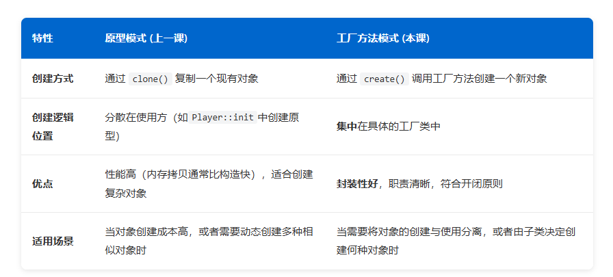

### 状态模式

1. 理解状态模式的核心思想：当一个对象的内在状态改变时，允许其改变行为，这个对象看起来好像改变了它的类。
2. 掌握如何将基于 if-else 和布尔标志的复杂状态管理，重构为面向对象的状态机。
3. 应用状态模式，彻底重构 HUDButton 类，使其逻辑更清晰、扩展性更强。

当前代码的问题在哪里？

让我们审视一下 HUDButton 类之前的实现。一个看似简单的按钮，为了实现“正常(Normal)”、“悬停(Hover)”和“按下(Press)”这三种状态，其内部代码是怎样的？

```C++
// src/screen/hud_button.cpp (旧代码)
void HUDButton::update(float) {
    checkHover(); // 检查鼠标是否悬停
    checkState(); // 根据标志位更新精灵
}

bool HUDButton::handleEvents(SDL_Event &event)
{
    // 一大堆 if-else 用于处理鼠标按下和抬起事件...
    if (event.type == SDL_EVENT_MOUSE_BUTTON_DOWN) {
        if (is_hover_){
            is_press_ = true;
            // ...
        }
    } else if (event.type == SDL_EVENT_MOUSE_BUTTON_UP) {
        is_press_ = false;
        if (is_hover_){
            is_trigger_ = true;
            // ...
        }
    }
    return false;
}

void HUDButton::checkState()
{
    // 另一大堆 if-else 用于根据 is_press_ 和 is_hover_ 切换显示的Sprite
    if (!is_press_ && !is_hover_){
        // Normal State...
    }else if (!is_press_ && is_hover_){
        // Hover State...
    }else {
        // Press State...
    }
}
```

这种实现方式的问题非常突出：

1. 逻辑高度耦合：所有状态的判断、事件处理和视觉表现全部挤在 HUDButton 这一个类中，形成了一个难以维护的“上帝类”。
2. “标志位地狱”：我们依赖于 is_hover_ 和 is_press_ 这两个布尔标志位。随着状态增多（例如增加一个“禁用”状态），标志位的数量和 if-else 的嵌套层级会爆炸式增长，代码将变得无法阅读。
3. 违反开闭原则：每当需要增加一个新状态时，我们都必须深入 HUDButton 的内部，修改 update、handleEvents 和 checkState 等多个函数，这极易引入新的 Bug。

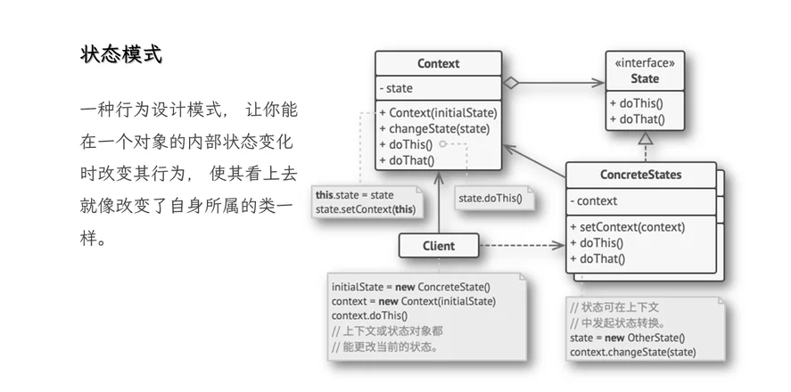

状态模式提供了一种优雅的解决方案：将与特定状态相关的行为局部化，并且将不同状态的行为分割开来。

它将每种状态的行为封装到各自独立的类中，然后由“上下文”对象（Context）持有当前状态的实例，并将所有与状态相关的操作委托给它。

现实世界类比： 想象一个自动售货机。它有“待机”、“已投币”、“售罄”等多种状态。

1. 当处于“待机”状态时，你投币，它会转换到“已投币”状态。
2. 当处于“已投币”状态时，你按下商品按钮，它会出货并转换回“待机”状态。
3. 当处于“售罄”状态时，无论你做什么，它都只会提示商品不足。
   
售货机（上下文）本身不包含复杂的 if-else。它只是将用户的操作（投币、按按钮）全权委托给它当前的“状态对象”去处理。而每个状态对象内部只关心两件事：1. 在本状态下该做什么；2. 满足什么条件后该转换到哪个新状态。

重构实战：打造一个状态驱动的 HUDButton

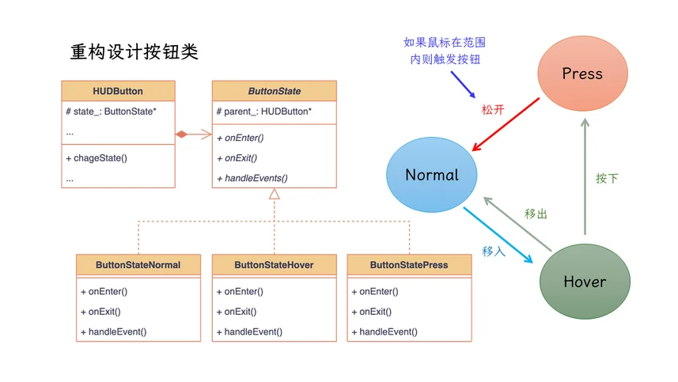

步骤 1: 定义一个抽象的 ButtonState 接口

我们首先创建一个 ButtonState 基类，它定义了所有具体状态类都必须遵守的“契约”。

```c++
// src/state/button_state.h
#ifndef BUTTON_STATE_H
#define BUTTON_STATE_H

#include "../core/object.h"
#include "../screen/hud_button.h"

class ButtonState : public Object {
protected:
    HUDButton* parent_ = nullptr; // 持有对“上下文”HUDButton的引用

public:
    // 状态的生命周期钩子：进入和退出
    virtual void onEnter() = 0;
    virtual void onExit() = 0;

    // ... setters
};

#endif // BUTTON_STATE_H
```

onEnter() 和 onExit() 是状态机的精髓，它们确保在状态切换时，能够执行必要的初始化和清理工作（比如切换Sprite、播放音效）。


步骤 2: 为每种状态创建具体的实现类

现在，我们将原来 HUDButton 中的 if-else 逻辑拆分到三个独立的类中。

正常状态 (ButtonStateNormal):

```c++
// src/state/button_state_normal.cpp
void ButtonStateNormal::onEnter() {
    parent_->getSpriteNormal()->setActive(true);
}
void ButtonStateNormal::onExit() {
    parent_->getSpriteNormal()->setActive(false);
}
bool ButtonStateNormal::handleEvents(SDL_Event& event) {
    if (event.type == SDL_EVENT_MOUSE_MOTION) {
        // ... 检查鼠标是否进入按钮范围
        if (/* isMouseInRect */){
            // 如果进入，则通知按钮切换到“悬停”状态
            parent_->changeState(new ButtonStateHover());
            return true;
        }
    }
    return false;
}
```

悬停状态 (ButtonStateHover):

```c++
// src/state/button_state_hover.cpp
// ...
bool ButtonStateHover::handleEvents(SDL_Event& event) {
    if (/* 鼠标移出 */) {
        parent_->changeState(new ButtonStateNormal()); // 切换回“正常”状态
        return true;
    }
    if (/* 鼠标按下 */) {
        parent_->changeState(new ButtonStatePress()); // 切换到“按下”状态
        return true;
    }
    return false;
}
```

按下状态 (ButtonStatePress) 的逻辑也类似。注意，现在每个类只关心自己的职责，代码清晰简洁。

步骤 3: 改造 HUDButton，让它成为一个纯粹的“上下文”

最后，我们来“净化”HUDButton。它不再需要任何布尔标志和复杂的逻辑判断。

```c++
// src/screen/hud_button.h
class ButtonState; // 前向声明
class HUDButton : public ObjectScreen {
protected:
    Sprite* sprite_normal_ = nullptr;
    Sprite* sprite_hover_ = nullptr;
    Sprite* sprite_press_ = nullptr;
    ButtonState* button_state_ = nullptr; // 只持有当前状态的指针
    bool is_trigger_ = false;
public:
    // 核心：状态转换方法
    void changeState(ButtonState* button_state);
    // ...
};

// src/screen/hud_button.cpp
void HUDButton::changeState(ButtonState *button_state)
{
    if (button_state_) {
        button_state_->onExit(); // 调用旧状态的退出逻辑
        button_state_->setNeedRemove(true);
    }
    button_state_ = button_state;
    // ... 设置新状态
    button_state_->onEnter(); // 调用新状态的进入逻辑
    safeAddChild(button_state_);
}
```

现在的 HUDButton 变得非常“干净”。它将所有事件都传递给当前的 button_state_ 对象去处理，自己只负责提供资源（三个 Sprite 指针）和执行状态切换的“仪式”。

总结

通过应用状态模式，我们获得了巨大的收益：

1. 单一职责原则：每个状态的行为都被封装在各自的类中。HUDButton 的职责也变得单一，只作为状态的管理者（上下文）。
2. 开闭原则：如果要增加一个“禁用”状态，我们只需创建一个 ButtonStateDisabled 类，然后在需要的地方调用 changeState 即可。完全不需要修改 HUDButton 和任何已有的状态类。
3. 代码清晰可读：我们用清晰的、可插拔的 State 对象，取代了混乱的、交织在一起的 if-else 逻辑。代码的可维护性和可读性得到了质的飞跃。

状态模式是管理具有复杂状态的对象行为的终极武器。无论是游戏中的角色（站立、行走、攻击、防御），还是UI元素，甚至是游戏流程（开始菜单、游戏中、暂停、游戏结束），都可以用状态模式来优雅地构建。

### 对象池模式

1. 理解性能瓶颈：认识到在游戏主循环中频繁使用 new 和 delete 会导致的性能开销与内存碎片问题。
2. 掌握对象池原理：学习通过“预分配、再利用”的核心思想来管理对象生命周期。
3. 实践与泛化：首先为“玩家子弹”实现一个具体的对象池，然后将其重构为一个泛用的模板类，并应用到更多对象上。

当前代码的问题在哪里？

SDLShooter 是一个飞行射击游戏，子弹、敌人、爆炸特效等对象被以极高的频率创建和销毁。让我们看看 SceneMain.cpp 中的代码片段：

```c++
// src/SceneMain.cpp (旧代码)
void SceneMain::shootPlayer()
{
    // 每发射一颗子弹，就在堆上分配一次内存
    auto projectile = new ProjectilePlayer(projectilePlayerPrototype);
    projectilesPlayer.push_back(projectile);
}

void SceneMain::updatePlayerProjectiles(float deltaTime)
{
    for (auto it = projectilesPlayer.begin(); it != projectilesPlayer.end();) {
        // ...
        if (/* 子弹超出屏幕或击中敌人 */) {
            // 子弹销毁，释放内存
            delete *it;
            it = projectilesPlayer.erase(it);
        }
        // ...
    }
}
```

几乎每一帧，我们都在重复 new 和 delete 的循环。这种做法存在两大性能杀手：

1. 高昂的内存分配开销：new (malloc) 和 delete (free) 是相对缓慢的操作系统调用。在对性能要求极致的游戏主循环中反复执行，会消耗大量 CPU 时间，可能导致游戏卡顿或掉帧。
2. 内存碎片化 (Memory Fragmentation)：频繁申请和释放大小不一的小块内存，会导致整个内存空间像一块被挖了无数小孔的“瑞士奶酪”。虽然总的可用内存很多，但可能没有一块足够大的连续空间来满足未来的内存申请，最终导致程序崩溃。

对象池模式的思想很简单，就像一个餐厅会清洗并重复使用餐具，而不是为每个新顾客都买一套新餐具。

核心思想：在游戏开始时，一次性创建出足够多的对象并放入“池”中。当需要新对象时，从池中取出一个；当对象不再需要时，不销毁它，而是将其“归还”到池中。

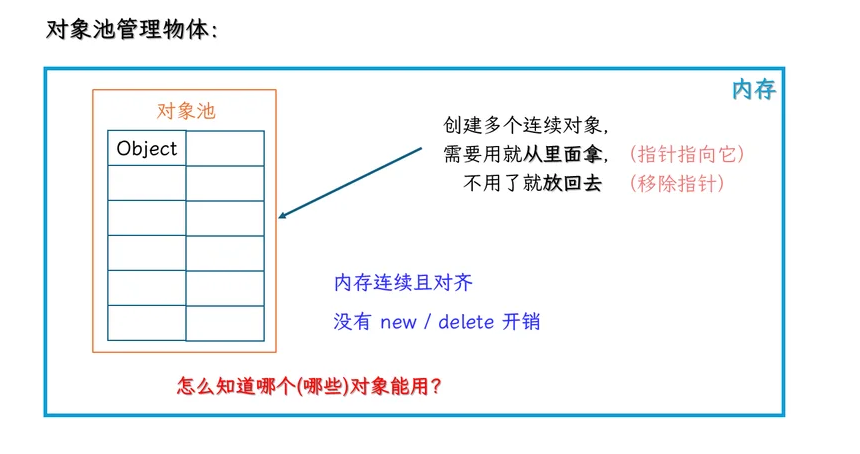

### 外观模式

想象一下你去一家大公司办事。你不需要知道财务部在哪、人事部在哪、技术支持又在哪。你只需要走到前台（总服务台），告诉前台你的需求，前台就会帮你联系相应的部门处理。这个“前台”就扮演了外观的角色。

外观模式的核心思想是：为一组复杂的子系统接口提供一个更高级别的、统一的接口。 客户端只需要与这个统一的接口（外观）交互，而不需要了解内部子系统的复杂实现和相互关系。

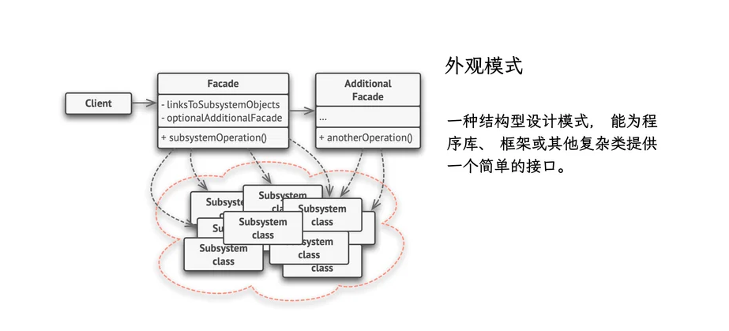

项目中的问题场景（假如没有外观模式）

在我们的引擎中，资源管理是一个复杂的系统，它包含：

TextureManager：负责加载、缓存和卸载 SDL_Texture。
AudioManager：负责加载、缓存和卸载 Mix_Chunk (音效) 和 Mix_Music (音乐)。
FontManager：负责加载、缓存和卸载不同字号的 TTF_Font。

如果没有一个统一的管理者，那么任何需要资源的代码（比如 SpriteComponent、AudioPlayer、TextRenderer）都必须分别持有这三个管理器的实例，并调用它们各自的接口。代码会变得像这样：

```c++
// 伪代码：假如没有 ResourceManager
class SpriteComponent {
    TextureManager* texManager;
    //...
    void render() {
        SDL_Texture* tex = texManager->getTexture(...);
        //...
    }
};

class AudioPlayer {
    AudioManager* audioManager;
    //...
    void playSound() {
        Mix_Chunk* chunk = audioManager->getSound(...);
        //...
    }
};
```

这会导致客户端代码与多个子系统紧密耦合，非常混乱且难以维护。

ResourceManager：一个经典的外观

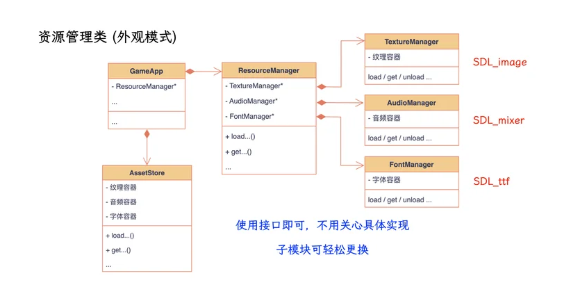

```c++
class ResourceManager final{
private:
    // 内部封装了复杂的子系统
    std::unique_ptr<TextureManager> texture_manager_;
    std::unique_ptr<AudioManager> audio_manager_;
    std::unique_ptr<FontManager> font_manager_;

public:
    explicit ResourceManager(SDL_Renderer* renderer);
    // ...

    // --- 统一资源访问接口 (外观接口) ---
    SDL_Texture* getTexture(std::string_view file_path);
    Mix_Chunk* getSound(std::string_view file_path);
    Mix_Music* getMusic(std::string_view file_path);
    TTF_Font* getFont(std::string_view file_path, int point_size);
    // ... 其他接口 ...
};
```

### 策略模式

假设你在开发一个AI系统，敌人有多种行为模式：一种只会在地面左右巡逻，一种会在空中上下飞行，还有一种会不停地跳跃。你会怎么实现？

最直接的想法可能是在 AIComponent::update 中写一个巨大的 switch 或 if-else 结构：

```c++
// 伪代码：不好的设计
void AIComponent::update(float dt) {
    switch (enemyType) {
        case PATROL:
            // ... 巡逻逻辑 ...
            break;
        case FLYING:
            // ... 上下飞行逻辑 ...
            break;
        case JUMPING:
            // ... 跳跃逻辑 ...
            break;
    }
}
```

这种做法的问题显而易见：AIComponent 类会变得越来越臃肿，每次增加一种新行为，都必须修改这个类，违反了 开闭原则（对扩展开放，对修改关闭）。

策略模式 优雅地解决了这个问题。它将每一种行为（算法）都封装到一个独立的对象中，让它们可以互相替换。

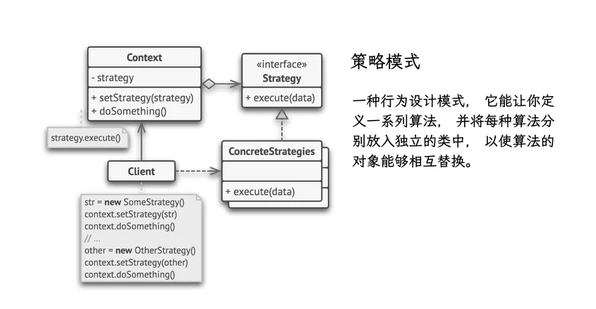

AIComponent 与 AIBehavior：一个标准的策略模式实现

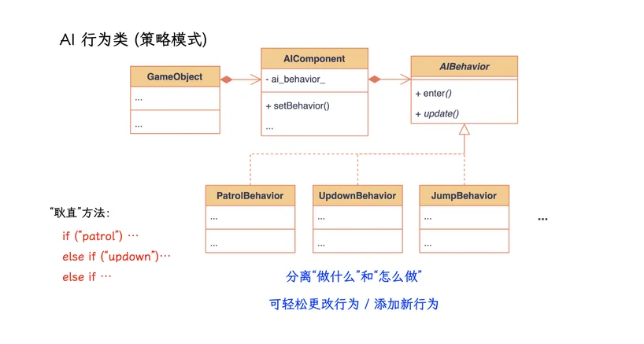

总结

本节课我们没有写一行新功能的代码，而是回顾了项目中已有的优秀结构，并为它们贴上了“设计模式”的标签。

1. 外观模式 (Facade)：通过 ResourceManager，我们学会了如何用一个简单的“门面”来隐藏一个复杂系统的内部细节，从而降低耦合，简化客户端代码。
2. 策略模式 (Strategy)：通过 AIComponent 和 AIBehavior，我们学会了如何将不同的行为算法封装成独立的对象，使得它们可以灵活地组合和替换，让代码更符合开闭原则，易于扩展。

### 生成器模式

生成器模式是一个非常实用的创建型模式，尤其适合用来构建具有多种组件和复杂配置的对象，比如我们游戏中的 GameObject。

#### 分解复杂的对象构建过程

1. 识别“构造函数地狱”：认识到当一个类（LevelLoader）承担了过多对象创建的细节时，代码会变得多么复杂和难以维护。
2. 理解生成器模式：学习如何将一个复杂对象的构建过程与其表示分离，使得同样的构建过程可以创建不同的表示。
3. 实践生成器模式：创建一个通用的 ObjectBuilder 类，将 GameObject 的创建逻辑从 LevelLoader 中剥离出来。
4. 重构与解耦：将 LevelLoader 重构为“指导者(Director)”，专注于解析地图数据并指挥 ObjectBuilder 工作，实现责任分离。

当前代码的问题在哪里？

让我们直面 SunnyLand 项目中最大的“代码异味”来源：LevelLoader::loadObjectLayer 函数。这个函数长达近 200 行，它几乎无所不能，也因此违反了单一职责原则。

它目前承担的职责包括：

1. 解析 Tiled 对象层 JSON 数据。
2. 区分自定义形状对象和基于图块的对象。
3. 计算 TransformComponent 所需的位置、旋转和缩放。 
4. 根据图块类型或自定义属性，决定是否创建 PhysicsComponent 和 ColliderComponent，并进行配置。
5. 解析自定义的 JSON 字符串来创建和配置 AnimationComponent。
6. 解析另一个自定义 JSON 字符串来配置 AudioComponent。
7. 根据属性创建 HealthComponent。
8. 最后，将所有这些组件组装成一个 GameObject。

这个函数就是一个典型的“上帝函数”。它的问题非常突出：

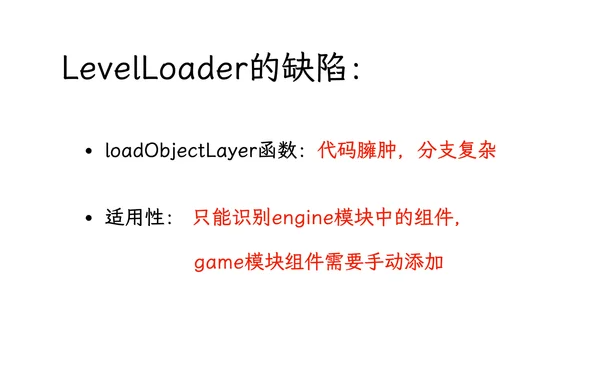

1. 极难阅读和维护：如此多的 if-else 和嵌套逻辑，让任何想修改它的人都望而却生。
2. 高度耦合：LevelLoader 必须了解 TransformComponent、PhysicsComponent、AnimationComponent 等所有组件的创建细节。如果未来我们新增一种 MagicComponent，就必须回来修改 LevelLoader。
3. 无法复用：这套复杂的 GameObject 创建逻辑被死死地焊在了 LevelLoader 内部。如果我们想从其他数据源（比如一个脚本文件）创建 GameObject，就无法复用这些代码。

第一步：引入生成器模式

要解决这个问题，我们需要引入生成器模式 (Builder Pattern)。

生成器模式的核心思想是将一个复杂对象的构建过程分解为一系列简单的步骤。想象一下组装一台电脑：你不会在一个函数里同时处理选择 CPU、安装内存、插上显卡、连接硬盘……而是会有一个“装机师傅”（生成器），你告诉他配置单（数据），他会一步步地 buildCPU(), buildMemory(), buildGPU()... 最后把整台电脑（产品）交给你。

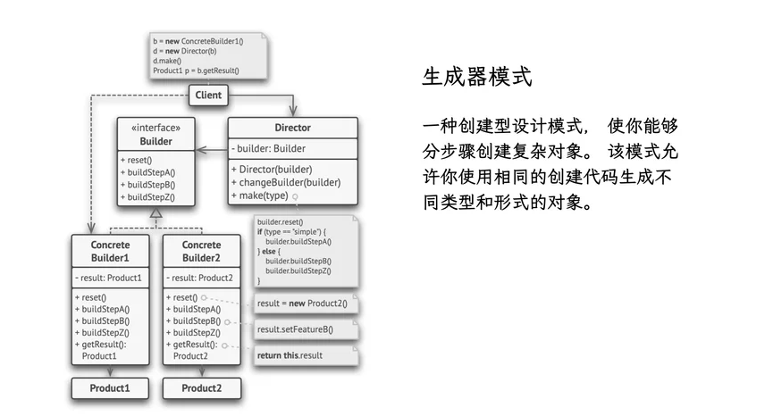

在这个模式中，有几个关键角色：

1. Product (产品)：我们想要创建的复杂对象，即 GameObject。
2. Builder (生成器)：负责具体构建步骤的接口或抽象类。我们的 ObjectBuilder 将扮演此角色。
3. Director (指导者)：负责调用生成器的各个步骤来构建产品。重构后的 LevelLoader 将扮演此角色。

第二步：创建通用的 ObjectBuilder

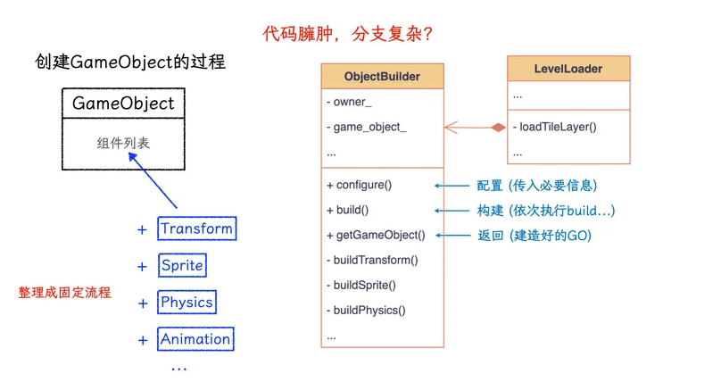

Step 1: 定义 ObjectBuilder 的接口

我们首先在 engine/object/ 目录下创建 object_builder.h 和 object_builder.cpp。

src/engine/object/object_builder.h (新建)

```c++
#pragma once
#include "../component/tilelayer_component.h"
#include <string>
#include <memory>
#include <nlohmann/json_fwd.hpp>
#include <glm/vec2.hpp>

namespace engine::core {
    class Context;
}
namespace engine::scene {
    class LevelLoader;
}
namespace engine::object {
    class GameObject;

class ObjectBuilder {
private:
    engine::scene::LevelLoader& level_loader_;
    engine::core::Context& context_;
    std::unique_ptr<GameObject> game_object_;

    // --- 解析游戏对象所需要的关键信息 ---
    const nlohmann::json* object_json_ = nullptr;
    const nlohmann::json* tile_json_ = nullptr;
    engine::component::TileInfo tile_info_;

    // ... 其他私有成员 ...

public:
    explicit ObjectBuilder(engine::scene::LevelLoader& level_loader, engine::core::Context& context);
    virtual ~ObjectBuilder() = default;

    // --- 三个关键方法：配置、构建、返回 ---
    ObjectBuilder* configure(const nlohmann::json* object_json);
    ObjectBuilder* configure(const nlohmann::json* object_json,
                             const nlohmann::json* tile_json,
                             engine::component::TileInfo);
    void build();
    std::unique_ptr<GameObject> getGameObject();

private:
    void reset();

    // --- 将原先在LevelLoader中的逻辑拆分成私有方法 ---
    void buildBase();
    void buildTransform();
    void buildSprite();
    void buildPhysics();
    void buildAnimation();
    void buildAudio();
    void buildHealth();
};

} // namespace engine::object
```

这个头文件定义了生成器的结构：

1. 它持有 LevelLoader 和 Context 的引用，因为构建过程需要它们。
2. configure() 方法用于接收构建所需的原始数据（JSON对象），它返回 ObjectBuilder* 以支持链式调用 (Fluent Interface)。我们为自定义形状和图块对象提供了不同的重载。
3. build() 方法是核心，它会按照顺序执行一系列私有的 build...() 步骤。
4. getGameObject() 用于在构建完成后获取最终的产品。
5. reset() 方法用于清空上一次构建的数据，确保每次构建都是独立的。

Step 2: 实现 ObjectBuilder 的构建逻辑

现在，我们将 LevelLoader::loadObjectLayer 中庞杂的逻辑，分门别类地迁移到 ObjectBuilder 的各个 build...() 方法中。

src/engine/object/object_builder.cpp (新建)

```c++
#include "object_builder.h"
#include "game_object.h"
// ... 其他组件头文件 ...

namespace engine::object {

ObjectBuilder::ObjectBuilder(engine::scene::LevelLoader& level_loader, engine::core::Context& context)
    : level_loader_(level_loader), context_(context) {}

// ... configure, getGameObject, reset 方法的实现 ...

void ObjectBuilder::build()
{
    if (!object_json_) return;
    // 按顺序构建各个组件
    buildBase();
    buildTransform();
    buildSprite();
    buildPhysics();
    buildAnimation();
    buildAudio();
    buildHealth();
}

// --- 挑选部分 build...() 方法展示 ---

void ObjectBuilder::buildBase()
{
    name_ = object_json_->value("name", "");
    auto tag = level_loader_.getTileProperty<std::string>(*object_json_, "tag");
    if (!tag && tile_json_) {
        tag = level_loader_.getTileProperty<std::string>(*tile_json_, "tag");
        if (!tag && tile_info_.type == engine::component::TileType::HAZARD) {
            tag = "hazard";
        }
    }
    game_object_ = std::make_unique<GameObject>(name_, tag.value_or(""));
}

void ObjectBuilder::buildTransform()
{
    auto position = glm::vec2(object_json_->value("x", 0.0f), object_json_->value("y", 0.0f));
    dst_size_ = glm::vec2(object_json_->value("width", 0.0f), object_json_->value("height", 0.0f));
    auto rotation = object_json_->value("rotation", 0.0f);
    auto scale = glm::vec2(1.0f);
    
    if (tile_json_) {
        position = glm::vec2(position.x, position.y - dst_size_.y);
        auto src_size_opt = tile_info_.sprite.getSourceRect();
        if (src_size_opt) {
            src_size_ = glm::vec2(src_size_opt->w, src_size_opt->h);
            scale = dst_size_ / src_size_;
        }   
    }
    game_object_->addComponent<engine::component::TransformComponent>(position, scale, rotation);
}

// ... 其他 build...() 方法的实现，都是从 LevelLoader 迁移过来的逻辑 ...

} // namespace engine::object
```

build() 方法就像一个施工蓝图(计划方案)，清晰地定义了 GameObject 的组装顺序。而每个 build...() 方法都只专注于创建一个特定的组件。这种结构清晰、易于理解和扩展。

第三步：重构 LevelLoader，让它成为“指导者”

现在 ObjectBuilder 已经准备就绪，我们可以对 LevelLoader::loadObjectLayer 进行大刀阔斧的重构了。

src/engine/scene/level_loader.h

```C++
// ...
namespace engine::object {
class ObjectBuilder;
}
// ...
class LevelLoader final {
    friend class engine::object::ObjectBuilder; // 允许 ObjectBuilder 访问其私有方法
    // ...
private:
    // ...
    // 添加对 ObjectBuilder 的友元声明，以便它能调用 getTileProperty 等辅助函数
    void addAnimation(const nlohmann::json& anim_json, engine::component::AnimationComponent* ac, const glm::vec2& sprite_size);
    void addSound(const nlohmann::json& sound_json, engine::component::AudioComponent* audio_component);
    // ...
};
```

src/engine/scene/level_loader.cpp

```C++
#include "level_loader.h"
#include "../object/object_builder.h" // 包含头文件
// ...

void LevelLoader::loadObjectLayer(const nlohmann::json& layer_json, Scene& scene)
{
    if (!layer_json.contains("objects") || !layer_json["objects"].is_array()) {
        // ... 错误处理 ...
        return;
    }
    // 1. 创建对象生成器
    engine::object::ObjectBuilder object_builder(*this, scene.getContext());

    const auto& objects = layer_json["objects"];
    for (const auto& object : objects) {
        auto gid = object.value("gid", 0);
        if (gid == 0) { // 自定义形状
            // 2. 配置并构建
            object_builder.configure(&object)->build();
        } else { // 图块对象
            auto tile_json = getTileJsonByGid(gid);
            auto tile_info = getTileInfoByGid(gid);
            if (!tile_json || !tile_json->is_object()) {
                // ... 错误处理 ...
                continue;
            }
            // 2. 配置并构建
            object_builder.configure(&object, &tile_json.value(), tile_info)->build();
        }
        
        // 3. 获取产品并添加到场景
        auto game_object = object_builder.getGameObject();
        if (game_object) {
            spdlog::info("加载对象: '{}' 完成", game_object->getName());
            scene.addGameObject(std::move(game_object));
        }
    }
}
```

看！loadObjectLayer 函数现在变得多么清爽！它的职责变得非常纯粹：

1. 遍历 Tiled 的 objects 数组。
2. 准备好构建所需的数据（object_json, tile_json, tile_info）。
3. 调用 object_builder 的 configure() 和 build()。
4. 从 object_builder 获取构建完成的 GameObject 并将其添加到场景中。
5. 
它不再关心 GameObject 内部是如何构成的，完全将复杂的构建过程委托给了 ObjectBuilder。LevelLoader 成功转型为一名合格的“指导者(Director)”。

在上一部分，我们成功创建了一个通用的 ObjectBuilder，将 GameObject 的基本构建逻辑从 LevelLoader 中分离了出来。

然而，我们留下了一个悬念：这个通用的 ObjectBuilder 位于引擎层，它不知道任何关于《SunnyLand》具体游戏逻辑，比如玩家 (PlayerComponent)、敌人AI (AIComponent + 具体行为) 等。我们如何将这些特定于游戏的构建步骤优雅地集成进去呢？

这就是本节课的重点：通过继承来扩展生成器。

#### 通过继承来扩展生成器

第一步：创建游戏专属生成器 ObjectBuilderSL

我们的思路是创建一个新的生成器 ObjectBuilderSL (SL for SunnyLand)，它继承自通用的 engine::object::ObjectBuilder。这个子类将重写 build() 方法，在调用父类通用的构建步骤之后，再追加自己独有的、与游戏逻辑相关的构建步骤。

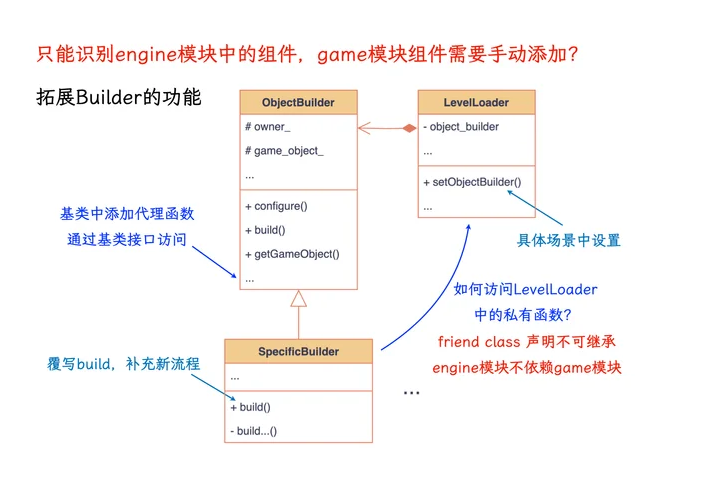

Step 1: 改造基类 ObjectBuilder

为了让子类能够访问 LevelLoader 的私有辅助函数（如 getTileProperty）并顺利地进行扩展，我们需要对基类做一些调整。

1. 将 ObjectBuilder 的私有成员 (private) 调整为保护成员 (protected)，这样子类就可以访问它们。
2. 将 build() 方法声明为 virtual，允许子类重写它。
3. 添加一些“代理函数”，让子类可以通过 ObjectBuilder 间接调用 LevelLoader 的私有辅助函数。

src/engine/object/object_builder.h (修改)

```C++
// ...
class ObjectBuilder {
protected: // 改为 protected
    engine::scene::LevelLoader& level_loader_;
    engine::core::Context& context_;
    // ... 其他成员 ...

public:
    // ...
    virtual void build(); // 声明为虚函数
    // ...
protected: // 新增
    // --- 代理函数，让子类能获取到LevelLoader的私有方法 ---
    template<typename T>
    std::optional<T> getTileProperty(const nlohmann::json& tile_json, std::string_view property_name);
    engine::component::TileType getTileType(const nlohmann::json& tile_json);
    std::optional<engine::utils::Rect> getColliderRect(const nlohmann::json& tile_json);
    void addAnimation(const nlohmann::json& anim_json, engine::component::AnimationComponent* ac, const glm::vec2& sprite_size);
    void addSound(const nlohmann::json& sound_json, engine::component::AudioComponent* audio_component);
    // ...
};
```

src/engine/object/object_builder.cpp (修改)

```C++
// ...
// --- 实现代理函数 ---
template<typename T>
std::optional<T> ObjectBuilder::getTileProperty(const nlohmann::json& tile_json, std::string_view property_name) {
    return level_loader_.getTileProperty<T>(tile_json, property_name);
}
// ... 其他代理函数的实现 ...
```

Step 2: 创建 ObjectBuilderSL

现在，我们在 game/object/ 目录下创建 object_builder_sl.h 和 object_builder_sl.cpp。

src/game/object/object_builder_sl.h (新建)

```C++
#pragma once
#include "../../engine/object/object_builder.h"

namespace game::object {

/**
 * @brief 针对具体游戏的对象生成器，继承自 engine::object::ObjectBuilder。
 *        添加游戏中的玩家、敌人、物品等对象的相关组件。
 */
class ObjectBuilderSL final : public engine::object::ObjectBuilder {
public:
    ObjectBuilderSL(engine::scene::LevelLoader& level_loader, engine::core::Context& context);
    ~ObjectBuilderSL() = default;

    void build() override; // 重写父类的 build 方法

private:
    // --- 针对具体游戏新添加的步骤 ---
    void buildPlayer();
    void buildEnemy();
    void buildItem();
};

}   // namespace game::object
```

Step 3: 实现 ObjectBuilderSL 的构建逻辑

ObjectBuilderSL 的 build() 方法首先调用父类的 build() 来完成通用组件的构建，然后依次调用自己特有的 buildPlayer(), buildEnemy() 等方法。

src/game/object/object_builder_sl.cpp (新建)

```C++
#include "object_builder_sl.h"
#include "../../engine/object/game_object.h"
// ... 包含 PlayerComponent, AIComponent, 各种 Behavior 等头文件 ...

namespace game::object {

ObjectBuilderSL::ObjectBuilderSL(engine::scene::LevelLoader& level_loader, engine::core::Context& context)
    : engine::object::ObjectBuilder(level_loader, context) {}

void ObjectBuilderSL::build() {
    ObjectBuilder::build(); // 1. 先调用父类的方法，构建通用组件
    
    // 2. 再调用子类特有的方法，构建游戏特定组件
    buildPlayer();
    buildEnemy();
    buildItem();
}

void ObjectBuilderSL::buildPlayer() {
    if (!tile_json_ || name_ != "player") return; // 如果不是名为 "player" 的图块对象，则不做任何事
    
    if (auto* player_component = game_object_->addComponent<game::component::PlayerComponent>(); player_component) {
        if (auto* transform = game_object_->getComponent<engine::component::TransformComponent>(); transform) {
            context_.getCamera().setTarget(transform);  // 相机跟随玩家
        }
    }
}

void ObjectBuilderSL::buildEnemy() {
    if (!tile_json_ || game_object_->getTag() != "enemy") return; // 如果不是标签为 "enemy" 的图块对象，则跳过
    
    if (name_ == "eagle") {
        if (auto* ai_component = game_object_->addComponent<game::component::AIComponent>(); ai_component) {
            auto y_max = game_object_->getComponent<engine::component::TransformComponent>()->getPosition().y;
            auto y_min = y_max - 80.0f;
            ai_component->setBehavior(std::make_unique<game::component::ai::UpDownBehavior>(y_min, y_max));
        }
    } else if (name_ == "frog") {
        // ... 为 frog 添加 JumpBehavior ...
    } else if (name_ == "opossum") {
        // ... 为 opossum 添加 PatrolBehavior ...
    }
}

void ObjectBuilderSL::buildItem() {
    if (!tile_json_ || game_object_->getTag() != "item") return;
    
    // 为所有 item 对象播放 "idle" 动画
    if (auto* ac = game_object_->addComponent<engine::component::AnimationComponent>(); ac) {
        ac->playAnimation("idle");
    }
}

}   // namespace game::object
```

看！我们将之前 GameScene::initEnemyAndItem() 和 GameScene::initPlayer() 中的逻辑，完美地迁移到了这个专门的生成器类中。每个 build...() 方法职责单一，代码清晰。

第二步：将 ObjectBuilderSL 注入 LevelLoader

现在我们有了更强大的、针对《SunnyLand》的 ObjectBuilderSL，我们需要让 LevelLoader 使用它，而不是默认的通用 ObjectBuilder。

Step 1: 修改 LevelLoader 以接受自定义生成器

LevelLoader 应该持有一个 ObjectBuilder 的基类指针，这样我们就可以在运行时给它提供任何 ObjectBuilder 的子类实例。

src/engine/scene/level_loader.h (修改)

```C++
// ...
class LevelLoader final {
    // ...
private:
    // ...
    std::unique_ptr<engine::object::ObjectBuilder> object_builder_; // 持有基类指针

public:
    LevelLoader(engine::core::Context& context); // 构造时创建默认 builder
    ~LevelLoader();

    // 提供一个方法来替换默认的 builder
    void setObjectBuilder(std::unique_ptr<engine::object::ObjectBuilder> object_builder);
    // ...
};
```

src/engine/scene/level_loader.cpp (修改)

```C++
// ...
LevelLoader::LevelLoader(engine::core::Context& context)
 : object_builder_(std::make_unique<engine::object::ObjectBuilder>(*this, context)){
    // 构造时，默认创建一个通用的 ObjectBuilder
}

void LevelLoader::setObjectBuilder(std::unique_ptr<engine::object::ObjectBuilder> object_builder) {
    // 允许外部传入一个更具体的 builder 来替换它
    object_builder_ = std::move(object_builder);
}
// ...
void LevelLoader::loadObjectLayer(...) {
    // ...
    // 不再在函数内部创建 builder，而是使用成员变量 object_builder_
    // engine::object::ObjectBuilder object_builder(*this, scene.getContext());
    // ...
    // 使用成员变量进行配置和构建
    object_builder_->configure(&object)->build();
    // ...
}
```

Step 2: 在 GameScene 中完成注入

最后，在 GameScene::initLevel() 中，我们在加载关卡之前，将我们特制的 ObjectBuilderSL “注入”到 LevelLoader 中。

src/game/scene/game_scene.cpp (修改)

```C++
#include "../object/object_builder_sl.h" // 包含新的 builder 头文件

// ...

bool GameScene::initLevel()
{
    // 创建关卡加载器
    engine::scene::LevelLoader level_loader(context_);

    // 创建我们游戏专属的生成器
    auto builder = std::make_unique<game::object::ObjectBuilderSL>(level_loader, context_);
    // 将它设置给 level_loader，替换掉默认的通用生成器
    level_loader.setObjectBuilder(std::move(builder)); 
    
    // 加载关卡（此时 level_loader 内部会使用我们提供的 ObjectBuilderSL）
    auto level_path = game_session_data_->getMapPath();
    if (!level_loader.loadLevel(level_path, *this)){
        // ...
    }
    // ...
    return true;
}

bool GameScene::initPlayer()
{
    // 获取玩家对象
    player_ = findGameObjectByName("player");
    if (!player_) { /*...*/ }
    
    // 从 SessionData 中更新玩家生命值
    if (auto health_component = player_->getComponent<engine::component::HealthComponent>(); health_component) {
        health_component->setMaxHealth(game_session_data_->getMaxHealth());
        health_component->setCurrentHealth(game_session_data_->getCurrentHealth());
    }
    // ...
    return true;
}
```

同时，我们可以把 GameScene 中的 initEnemyAndItem() 方法以及它的调用彻底删除了，因为它的所有逻辑现在都已经被 ObjectBuilderSL 自动处理了！

至此，GameObject 的创建过程被完全重构。GameScene 不再关心任何关于玩家、敌人或物品如何初始化的细节。它只需要命令 LevelLoader 加载关卡，LevelLoader 会指挥 ObjectBuilderSL 精确地构建出所有需要的对象，并将它们添加到场景中。整个流程实现了完美的数据驱动和责任分离。

总结

通过两部分的学习，我们彻底重构了 GameObject 的创建流程，实现了生成器模式的经典应用：

1. 分解复杂性：我们将一个巨大的函数分解为一系列清晰、独立的构建步骤，封装在 ObjectBuilder 中。
2. 责任分离 (SoC)：LevelLoader (Director) 负责“何时”与“以何种顺序”构建，而 ObjectBuilder (Builder) 负责“如何”构建每个部分。
3. 可扩展性：通过继承，我们创建了特定于游戏的 ObjectBuilderSL，在不修改通用引擎代码的情况下，添加了游戏逻辑相关的构建步骤。
3. 数据驱动：现在，对象的绝大部分配置（包括AI行为、动画、生命值等）都来自于 Tiled 编辑器导出的 JSON 数据，代码与数据分离，大大提高了开发和调试效率。

生成器模式是处理复杂对象创建的强大工具。当你发现一个类的构造函数参数过多，或者一个工厂方法过于臃肿时，就是考虑使用生成器模式的最佳时机。

### 命令模式

命令模式（Command Pattern） 的核心思想就是：把“请求”封装成一个“对象”。

通常我们调用功能是直接执行（比如：手机.开灯()）。但在命令模式下，我们不直接调用，而是先把“开灯”这个动作打包成一个名为 开灯命令 的小盒子（对象），然后把这个盒子丢给执行者。

为什么要把动作变成“对象”？（核心痛点）

如果你直接调用函数，动作发出的那一刻就执行了。但如果变成对象，你就可以：

1. 排队执行： 像餐厅的点菜记录单，厨师可以一张张按顺序做。

2. 撤销操作（Undo）： 每一个命令对象都可以自带一个 undo() 方法。你想反悔？点一下就行。

3. 日志记录： 把所有的命令对象存起来，系统崩溃了也能按记录恢复。

4. 延迟执行： 把命令定个闹钟，等会儿再执行。

#### 重构输入处理

课程目标

1. 识别紧耦合的设计：分析当前 PlayerState 子类直接依赖 InputManager 带来的问题。
2. 重构状态机：将输入检测的逻辑从各个 PlayerState 子类中移除，统一上移到 PlayerComponent 中。
3. 定义行为接口：在 PlayerState 基类中定义一组代表玩家动作的虚函数（如 moveLeft(), jump()），由具体的子类来实现。
4. 为命令模式铺路：通过这次重构，将“检测输入”和“执行动作”这两个职责分离开，为下一步引入命令对象打下坚实的基础。

当前代码的问题在哪里？

目前，我们的玩家状态机设计是这样的：PlayerComponent 的 handleInput 方法将输入处理的职责完全委托给了当前的 PlayerState 对象。

```C++
// src/game/component/player_component.cpp (旧代码)
void PlayerComponent::handleInput(engine::core::Context& context) {
    if (!current_state_) return;

    // 将 context (包含 InputManager) 传递给状态对象
    auto next_state = current_state_->handleInput(context);
    if (next_state) {
        setState(std::move(next_state));
    }
}
```

每个具体的状态类，比如 IdleState，都直接从 InputManager 查询按键状态，并据此决定是否切换到其他状态。

```C++
// src/game/component/state/idle_state.cpp (旧代码)
std::unique_ptr<PlayerState> IdleState::handleInput(engine::core::Context& context)
{
    auto input_manager = context.getInputManager();

    // 如果按下了左右移动键，则切换到 WalkState
    if (input_manager.isActionDown("move_left") || input_manager.isActionDown("move_right")) {
        return std::make_unique<WalkState>(player_component_);
    }

    // 如果按下“jump”则切换到 JumpState
    if (input_manager.isActionPressed("jump")) {
        return std::make_unique<JumpState>(player_component_);
    }
    // ...
    return nullptr;
}
```

这种设计虽然直观，但存在几个问题：

1. 职责不清：PlayerState 子类的职责应该是定义在特定状态下，接收到某个动作请求时该如何响应，而不应该关心这个动作请求是来自键盘、手柄还是网络。它直接与 InputManager 耦合，意味着它承担了“检测输入”的职责，这超出了它的核心职责范围。
2. 代码重复：JumpState、FallState、WalkState 等多个状态都需要处理左右移动的逻辑，导致类似 input_manager.isActionDown("move_left") 这样的代码在多个文件中重复出现。
3. 扩展困难：如果我们想加入手柄支持，或者允许玩家自定义按键映射，我们就可能需要修改所有 handleInput 的实现。如果我们想实现一个AI来控制玩家（比如录像回放），AI模块就需要模拟 InputManager 的行为，这非常不便。
   
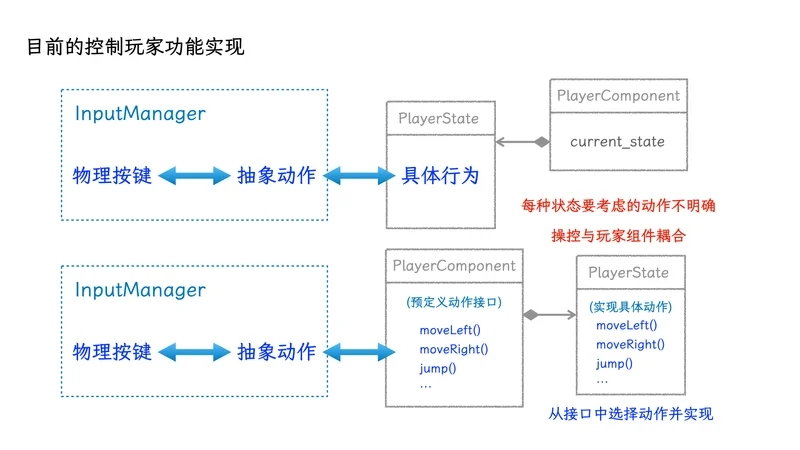

第一步：将输入检测上移至 PlayerComponent

我们的目标是让 PlayerState 子类变得“纯粹”，它们不再关心输入来自何方，只关心收到了什么“指令”。

首先，我们将 PlayerComponent::handleInput 的逻辑修改为它自己来检测输入，然后调用自身对应的动作方法。

src/game/component/player_component.cpp (修改)

```C++
void PlayerComponent::handleInput(engine::core::Context& context) {
    if (!current_state_) return;

    // --- 在 PlayerComponent 中统一检测输入 ---
    auto& input_manager = context.getInputManager();
    
    // 判断左右移动操作
    if (input_manager.isActionDown("move_left")) moveLeft();
    else if (input_manager.isActionDown("move_right")) moveRight();
    
    // 判断跳跃或上下移动操作
    if (input_manager.isActionPressed("jump")) jump();
    else if (input_manager.isActionDown("move_up")) climbUp();
    else if (input_manager.isActionDown("move_down")) climbDown();
}
```

PlayerComponent 现在成了唯一与 InputManager 直接交互的地方。它像一个“总指挥”，负责接收外部输入，然后向内部的状态机下达明确的指令，如 moveLeft()、jump() 等。

第二步：在 PlayerState 中定义动作接口

PlayerComponent 调用的 moveLeft() 等方法是什么呢？它们会进一步将请求委托给当前的 PlayerState 对象。为此，我们需要在 PlayerState 基类中定义一套标准的动作接口。

src/game/component/state/player_state.h (修改)

```C++
class PlayerState {
// ...
public:
    // ...
    // --- 定义一套标准的动作接口 ---
    virtual std::unique_ptr<PlayerState> moveLeft() { return nullptr; }
    virtual std::unique_ptr<PlayerState> moveRight() { return nullptr; }
    virtual std::unique_ptr<PlayerState> jump() { return nullptr; }
    virtual std::unique_ptr<PlayerState> climbUp() { return nullptr; }
    virtual std::unique_ptr<PlayerState> climbDown() { return nullptr; }

protected:
    virtual void enter() = 0;
    virtual void exit() = 0;
    // 不再需要 handleInput 方法
    // virtual std::unique_ptr<PlayerState> handleInput(engine::core::Context&) = 0;
    virtual std::unique_ptr<PlayerState> update(float, engine::core::Context&) = 0;
};
```

我们将 handleInput 方法彻底移除，取而代之的是一组代表具体动作的虚函数。这些函数都有默认实现（返回 nullptr），这意味着子类只需要重写它们关心的动作。例如，HurtState（受伤硬直状态）就不需要实现任何动作，因为它不响应任何输入。

PlayerComponent 中的动作方法实现如下：

src/game/component/player_component.cpp (修改)

```C++
void PlayerComponent::moveLeft() {
    // 将 moveLeft 请求委托给当前状态
    auto next_state = current_state_->moveLeft();
    if (next_state) setState(std::move(next_state));
}

void PlayerComponent::jump() {
    // 将 jump 请求委托给当前状态
    auto next_state = current_state_->jump();
    if (next_state) setState(std::move(next_state));
}
// ... 其他动作方法的实现类似 ...
```

第三步：改造具体的状态类

现在，我们可以清理所有的 PlayerState 子类了。我们将它们各自的 handleInput 方法中的逻辑，拆分到对应的动作方法中。

以 IdleState 为例：

src/game/component/state/idle_state.cpp (修改)

```C++
// 移除 handleInput 方法...

std::unique_ptr<PlayerState> IdleState::moveLeft() {
    // 在待机状态下收到向左移动的请求，应该切换到行走状态
    return std::make_unique<WalkState>(player_component_);
}

std::unique_ptr<PlayerState> IdleState::moveRight() {
    // 同上
    return std::make_unique<WalkState>(player_component_);
}

std::unique_ptr<PlayerState> IdleState::jump() {
    // 收到跳跃请求，切换到跳跃状态
    return std::make_unique<JumpState>(player_component_);
}

std::unique_ptr<PlayerState> IdleState::climbUp() {
    auto physics_component = player_component_->getPhysicsComponent();
    // 只有在接触梯子时，向上爬的请求才有效
    if (physics_component->hasCollidedLadder()) {
        return std::make_unique<ClimbState>(player_component_);
    }
    return nullptr; // 否则忽略该请求
}
// ... 其他方法的实现 ...
```

再看一个例子，WalkState：

src/game/component/state/walk_state.cpp (修改)

```C++
// ...
std::unique_ptr<PlayerState> WalkState::moveLeft() {
    // 在行走状态下收到向左移动的请求，执行向左移动的物理逻辑
    auto physics_component = player_component_->getPhysicsComponent();
    auto sprite_component = player_component_->getSpriteComponent();

    // ... (添加向左的力，翻转精灵等) ...

    is_moving_ = true; // 标记本帧有移动输入
    return nullptr; // 不需要切换状态
}

std::unique_ptr<PlayerState> WalkState::update(float, engine::core::Context&)
{
    // ...
    // 如果本帧没有任何移动输入 (is_moving_ 为 false)，则切换到待机状态
    if (!is_moving_) {
        return std::make_unique<IdleState>(player_component_);
    }
    // ...
    is_moving_ = false; // 在 update 的最后重置标志，为下一帧做准备
    return nullptr;
}
```

通过这种方式，每个状态类的职责变得非常清晰：

1. IdleState: 收到 moveLeft 请求 -> 切换到 WalkState。
2. WalkState: 收到 moveLeft 请求 -> 施加一个力，继续保持 WalkState。
3. HurtState: 收到 伤害 请求 -> (默认实现) 什么都不做，忽略请求。

小结 (Part 1)

通过这次重构，我们取得了显著的进步：

1. 职责分离：PlayerComponent 负责“监听”输入，PlayerState 负责“响应”动作。二者职责明确。
2. 解耦：PlayerState 不再与 InputManager 耦合，它只响应 moveLeft() 这样的抽象指令。
3. 代码更清晰：输入处理逻辑被集中到了 PlayerComponent 中，状态类的代码也变得更加纯粹和易于理解。
4. 
我们成功地在“输入源”和“动作执行者”之间建立了一个清晰的边界。现在，PlayerComponent 就像一个遥控器，而 PlayerState 就像电视机内部的电路。

这个“遥控器”还很简单，它直接调用了 player->moveLeft()。在下一部分，我们将引入命令模式，把 moveLeft() 这个调用本身也封装成一个对象。这将为我们带来前所未有的灵活性，比如实现按键自定义、AI控制，甚至是双人同屏游戏！

#### 封装请求为对象

课程目标

1. 理解命令模式：学习如何将一个请求封装为一个对象，从而可用不同的请求对客户进行参数化，对请求排队或记录请求日志，以及支持可撤销的操作。
2. 实现命令对象：为玩家的每个动作（moveLeft, jump 等）创建一个具体的 Command 子类。
3. 解耦请求者与接收者：将输入处理（请求者）与 PlayerComponent（接收者）彻底解耦，通过命令对象进行通信。
4. 实践应用：利用命令模式的灵活性，轻松实现一个双人同屏的控制切换功能。

为什么要把“调用一个函数”这么简单的事搞复杂？

我们目前的 PlayerComponent::handleInput 是这样的：

```C++
// src/game/component/player_component.cpp (重构后)
void PlayerComponent::handleInput(engine::core::Context& context) {
    auto& input_manager = context.getInputManager();
    if (input_manager.isActionDown("move_left")) moveLeft();
    else if (input_manager.isActionDown("move_right")) moveRight();
    // ...
}
```

“按下A键”和“执行moveLeft()”这两个概念被直接绑定在了一起。这在单人游戏中似乎没什么问题，但如果我们想：

1. 让玩家自定义按键？ 比如把“向左移动”从'A'键改成'Q'键。我们需要修改 InputManager 的配置，但如果逻辑更复杂，可能会很麻烦。
2. 让AI控制一个角色？ AI模块需要找到 PlayerComponent 实例，然后直接调用 moveLeft()。AI和玩家组件产生了耦合。
3. 实现双人游戏？ P1用WASD，P2用方向键，他们都想控制各自角色的“向左移动”。handleInput 里的 if 语句会变得非常复杂。
4. 实现网络同步？ 我们不能把“A键被按下”这个事件发送到网络上，因为其他玩家的按键设置可能不同。我们应该发送“玩家执行了‘向左移动’这个动作”。

命令模式正是为了解决这些问题而生的。它将“请求”（比如“向左移动”）本身封装成一个对象，从而将“谁发出的请求”（InputManager）和“谁执行请求”（PlayerComponent）分离开。

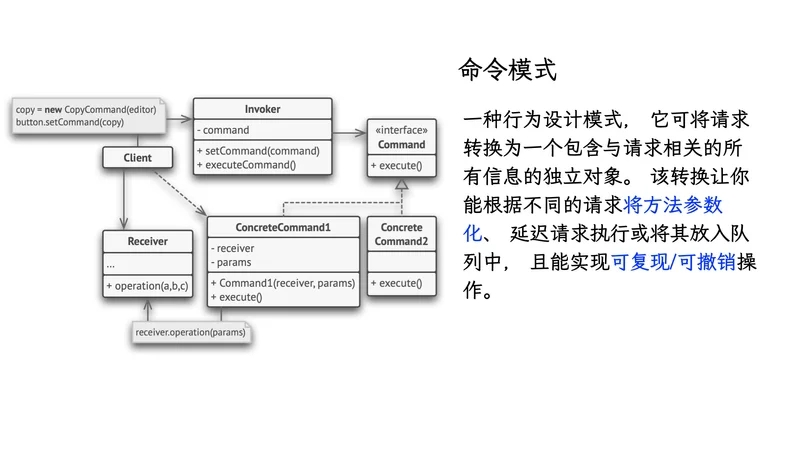

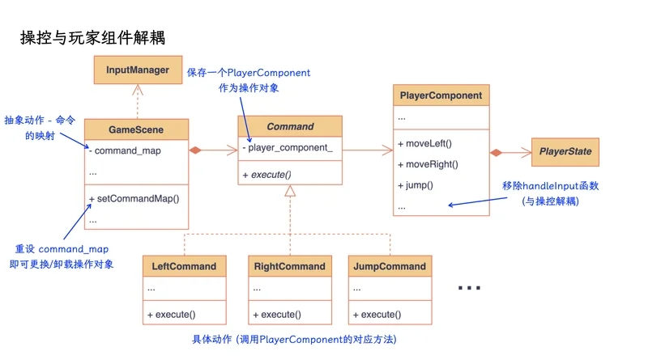

第一步：定义并实现命令

Step 1: 创建 Command 基类

我们首先在 game/component/command/ 目录下创建一个 Command 接口。所有具体的命令都将继承自它。

src/game/component/command/command.h (新建)

```c++
#pragma once

namespace game::component {
    class PlayerComponent;
}

namespace game::component::command {

/**
 * @brief 命令模式中的命令抽象基类。
 */
class Command {
protected:
    PlayerComponent& player_component_; // 每个命令都需要知道它要操作哪个玩家
public:
    Command(PlayerComponent& player_component) : player_component_(player_component) {}
    virtual ~Command() = default;

    virtual void execute() = 0; // 所有命令都有一个执行接口
};

}   // namespace game::component::command
```

Step 2: 创建具体的命令类

现在，我们为玩家的每一个动作都创建一个具体的命令类。这些类非常简单，它们的 execute() 方法只是调用 PlayerComponent 对应的动作方法。

src/game/component/command/left_command.h (新建)

```c++
#pragma once
#include "command.h"

namespace game::component::command {

class LeftCommand : public Command {
public:
    LeftCommand(PlayerComponent& player_component) : Command(player_component) {}
    void execute() override;
};

}   // namespace game::component::command
```

src/game/component/command/left_command.cpp (新建)

```c++
#include "left_command.h"
#include "../player_component.h"

namespace game::component::command {

void LeftCommand::execute() {
    player_component_.moveLeft();
}

}   // namespace game::component::command
```

同理，我们创建 RightCommand, JumpCommand, UpCommand, DownCommand。这些命令对象就是被封装起来的“请求”。

第二步：在 GameScene 中使用命令

现在，我们需要一个地方来管理“输入”和“命令”之间的映射关系。GameScene 是一个理想的场所，因为它管理着场景中的所有对象，包括玩家。

Step 1: 将输入处理逻辑移至 GameScene
我们首先将 PlayerComponent::handleInput 的逻辑完全迁移到 GameScene::handleInput 中，并清空 PlayerComponent 的 handleInput 方法。

src/game/component/player_component.h (修改)

```c++
// ...
private:
    // 核心循环函数
    void init() override;
    // handleInput 不再需要了
    // void handleInput(engine::core::Context& context) override;
    void update(float delta_time, engine::core::Context& context) override;
// ...
```

Step 2: 建立输入到命令的映射

GameScene 将持有一个 map，将输入的动作名称（如 "move_left"）映射到一个具体的命令对象。

src/game/scene/game_scene.h (修改)

```c++
// ...
#include <unordered_map>

namespace game::component::command {
    class Command;
}
// ...
class GameScene final: public engine::scene::Scene {
    // ...
private:
    // ...
    // 命令映射表，将动作名称映射到命令对象
    std::unordered_map<std::string, std::unique_ptr<game::component::command::Command>> command_map_;
    
    // ...
    void setCommandMap(game::component::PlayerComponent& player_component);
};
```

setCommandMap 方法负责填充这个 map，它将为特定的 PlayerComponent 实例创建一套完整的命令对象。

```c++
#include "../component/command/up_command.h"
// ... 包含所有具体 Command 的头文件 ...

void GameScene::setCommandMap(game::component::PlayerComponent& player_component)
{
    // 使用 operator[] 进行覆盖性插入
    command_map_["move_up"] = std::make_unique<game::component::command::UpCommand>(player_component);
    command_map_["move_down"] = std::make_unique<game::component::command::DownCommand>(player_component);
    command_map_["move_left"] = std::make_unique<game::component::command::LeftCommand>(player_component);
    command_map_["move_right"] = std::make_unique<game::component::command::RightCommand>(player_component);
    command_map_["jump"] = std::make_unique<game::component::command::JumpCommand>(player_component);
}
```

在 GameScene::init() 中，我们找到玩家对象后，立即为它设置命令映射。

```c++
// src/game/scene/game_scene.cpp (修改)
void GameScene::init() {
    // ...
    if (!initPlayer()) { /* ... */ }

    // 为主玩家设置命令映射表
    if (auto player_component = player_->getComponent<game::component::PlayerComponent>(); player_component) {  
        setCommandMap(*player_component);
    } else {
        // ... 错误处理 ...
    }
    // ...
}
```

Step 3: 执行命令

最后，GameScene::handleInput 的逻辑变为：检测输入，从 map 中找到对应的命令对象，然后调用它的 execute() 方法。

src/game/scene/game_scene.cpp (修改)

```c++
void GameScene::handleInput() {
    Scene::handleInput();
    // ... 暂停逻辑 ...

    // --- 根据输入执行对应的命令 ---
    if (context_.getInputManager().isActionDown("move_left")) {
        // 查找 "move_left" 对应的命令
        if (auto command = command_map_.find("move_left"); command != command_map_.end()) {
            command->second->execute(); // 执行命令
        }
    } else if (context_.getInputManager().isActionDown("move_right")) {
        // ... 执行 "move_right" 命令 ...
    }
    // ... 其他输入的处理 ...
}
```

现在，GameScene::handleInput 不再知道 PlayerComponent 的存在，也不知道 moveLeft() 这个方法。

它只知道：“当'move_left'动作被触发时，执行与之关联的那个命令对象”。请求者（GameScene）和接收者（PlayerComponent）被彻底解耦了！

第三步：命令模式的威力——实现双人同屏

解耦带来了巨大的灵活性。现在，让我们来展示命令模式的威力：轻松实现一个“切换控制角色”的功能，模拟双人游戏。

Step 1: 在地图中添加第二个玩家

我们在 Tiled 编辑器中，复制一个玩家对象，并将其命名为 player2。我们给这两个玩家对象都设置一个 "player" 标签，以便 ObjectBuilderSL 能识别它们并添加 PlayerComponent。

assets/maps/level1.tmj (修改)

```json
// ... objectgroup "objects" ...
{
    "gid":608, "height":32, "id":20,
    "name":"player2",
    "properties":[
        {
         "name":"tag",
         "type":"string",
         "value":"player"
        }],
    // ...
}
```

src/game/object/object_builder_sl.cpp (修改)

```c++
void ObjectBuilderSL::buildPlayer() {
    // 不再根据 name 判断，而是根据 tag
    if (!tile_json_ || game_object_->getTag() != "player") return;
    
    // ... 添加 PlayerComponent 和设置相机 ...
    // 注意：这里两个玩家都会设置相机目标，后设置的会覆盖前者，这正是我们想要的初始状态
}
```

Step 2: 实现切换逻辑

我们在 GameScene 中添加一个 switchPlayer() 方法。这个方法会找到场景中的 player 和 player2，然后切换相机目标，并重新设置命令映射表，将所有命令的目标指向新的 PlayerComponent。

src/game/scene/game_scene.cpp (修改)

```c++
void GameScene::switchPlayer()
{
    spdlog::info("切换操控的玩家对象");
    auto player2 = findGameObjectByName("player2");
    if (!player2) return;
    
    // 用静态变量追踪当前操控的玩家
    static engine::object::GameObject* current_player = player_;

    // 切换玩家
    current_player = (current_player == player_) ? player2 : player_;

    // 切换相机跟随目标
    auto transform = current_player->getComponent<engine::component::TransformComponent>();
    context_.getCamera().setTarget(transform);

    // 重新绑定命令到新的玩家组件！
    auto player_component = current_player->getComponent<game::component::PlayerComponent>();
    if (player_component) {
        setCommandMap(*player_component);
    }
}
```

最后，在 handleInput 中，我们监听一个按键（比如 "attack"，即K键）来触发这个切换。

```c++
// src/game/scene/game_scene.cpp (修改)
void GameScene::handleInput() {
    // ...
    // 按下 K 键切换玩家
    if (context_.getInputManager().isActionPressed("attack")) {
        switchPlayer();
    }
}
```

现在运行游戏，你会看到两个玩家角色。按下 K 键，你会发现你的操作（WASD和J）立即从控制第一个角色切换到了第二个角色！我们没有修改任何关于 PlayerComponent 或 PlayerState 的代码，仅仅是重新配置了命令映射，就实现了控制权的转移。这就是命令模式的强大之处。

总结

通过引入命令模式，我们的输入系统变得前所未有的灵活和强大：

1. 完全解耦：输入处理逻辑（GameScene）不知道玩家的存在，玩家（PlayerComponent）也不知道输入来自何方。它们通过抽象的 Command 对象进行通信。
2. 请求对象化：将“向左移动”这个动作变成了一个 LeftCommand 对象。这个对象可以被存储、传递、甚至通过网络发送。
3. 高度可配置：我们可以轻易地改变 command_map_ 中的映射，实现按键自定义，或者像我们做的那样，将一整套控制绑定到不同的角色上。
4. 易于扩展：如果想添加一个“冲刺”动作，我们只需：
    1. 在 PlayerState 中添加 dash() 接口。
    2. 在 PlayerComponent 中添加 dash() 方法。
    3. 创建一个 DashCommand 类。
    4. 在 GameScene 中将 "dash" 输入动作映射到 DashCommand 实例。整个过程无需修改现有代码，符合开闭原则。
   
命令模式是构建复杂交互系统（如可自定义输入的动作游戏、策略游戏中的单位指令、编辑器中的撤销/重做功能）的基石。掌握它，你就能构建出更专业、更灵活的游戏系统。

### 观察者模式

观察者模式又叫**发布-订阅模式**

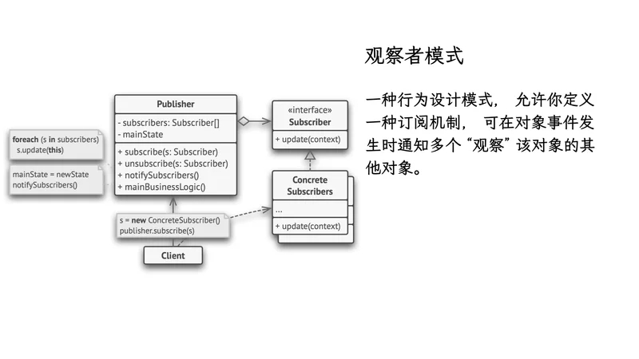

### 脏标识模式

脏标识模式 (Dirty Flag Pattern)是一个简单但极其有效的优化技巧，它的核心思想是避免不必要的重复计算。

### 服务定位器模式

服务定位器模式 (Service Locator)是一个在游戏引擎架构中非常常见的设计模式，它旨在解决一个核心问题：如何在项目的各个角落方便地访问像音频播放器这样的全局单例服务

课程目标

1. 理解“依赖注入地狱”：认识到通过构造函数或 Context 对象层层传递全局服务（如 AudioPlayer）所带来的代码冗余和紧耦合问题。
2. 掌握服务定位器模式：学习如何通过一个静态的中心注册点（AudioLocator）来提供对服务的全局访问。
3. 解耦具体实现：通过引入服务接口 (IAudioPlayer)，让客户端代码依赖于抽象而不是具体实现，从而可以轻松替换或禁用服务（如静音模式）。
4. 实践与重构：
   1. 创建一个 IAudioPlayer 接口和一个什么都不做的 NullAudioPlayer 实现。
   2. 创建一个静态的 AudioLocator 类来提供对 IAudioPlayer 服务的访问。
   3. 在 GameApp 中“注册”真正的 AudioPlayer 服务。
   4. 重构所有需要播放音频的代码，让它们通过 AudioLocator::get() 来访问音频服务。

当前代码的问题在哪里？

目前，如果一个组件（比如 AudioComponent 或 UIInteractive）想要播放声音，它必须以某种方式获得 AudioPlayer 的实例。我们之前的做法是通过 Context 对象进行传递：

GameApp -> Context -> Scene -> UIInteractive -> playSound()

这个依赖链条非常长：

1. GameApp 创建 AudioPlayer 实例。
2. GameApp 将 AudioPlayer 的引用注入 Context。
3. Scene 持有 Context 的引用。
4. UIInteractive 在构造时接收 Context 的引用。
5. UIInteractive 最终通过 context_.getAudioPlayer() 来调用播放方法。
   
这种依赖注入 (Dependency Injection) 方式虽然明确，但在处理像音频、日志、输入这样的全局性服务时，会显得非常笨重：

1. 冗长的参数列表：几乎每个核心类的构造函数都需要接收一个 Context&，即使它自己可能用不上，只是为了把它传递给子对象。
2. 紧耦合：所有中间环节（Context, Scene 等）都与 AudioPlayer 这个具体类产生了耦合。如果我们想更换音频引擎，或者在测试时禁用音频，会非常困难。
3. 访问不便：在项目的某个深层角落，如果一个新类突然需要播放声音，我们就得一路从 GameApp 开始，把 Context 或 AudioPlayer 的引用层层“钻”下去，这非常痛苦。
   
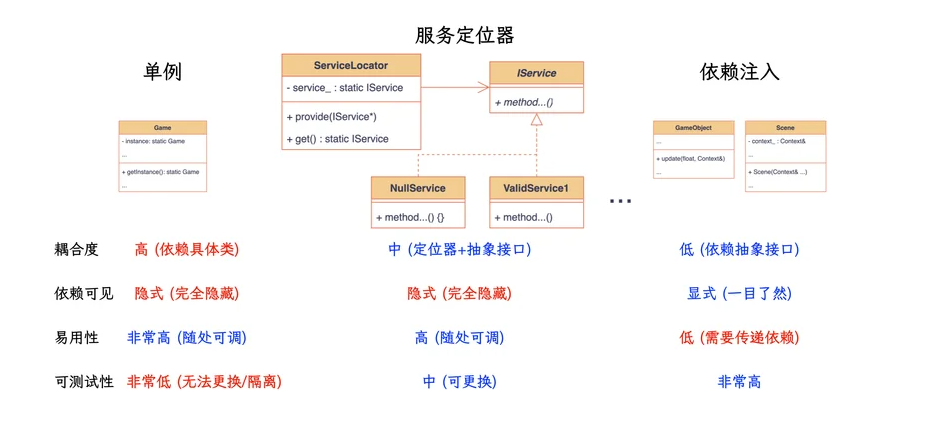

第一步：定义服务接口 IAudioPlayer

要解耦客户端与具体实现，第一步总是引入一个抽象接口。我们将 AudioPlayer 的所有公共方法提取到一个纯虚基类 IAudioPlayer 中。

src/engine/audio/iaudio_player.h (新建)

```c++
#pragma once
#include <string_view>

namespace engine::audio {

class IAudioPlayer {
public:
    virtual ~IAudioPlayer() = default;
    virtual int playSound(std::string_view sound_path, int channel = -1) = 0;
    virtual bool playMusic(std::string_view music_path, int loops = -1, int fade_in_ms = 0) = 0;
    // ... 其他所有音频方法的纯虚声明 ...
};
```

接着，让我们的 AudioPlayer 实现这个接口。

src/engine/audio/audio_player.h (修改)

```c++
#pragma once
#include "iaudio_player.h"
// ...
class AudioPlayer final : public IAudioPlayer {
public:
    // ...
    int playSound(std::string_view sound_path, int channel = -1) override;
    bool playMusic(std::string_view music_path, int loops = -1, int fade_in_ms = 0) override;
    // ... 标记所有方法为 override
};
```

第二步：引入空对象模式 (Null Object Pattern)

服务定位器模式的一个最佳实践是：永远不要返回 nullptr。如果客户端每次调用 AudioLocator::get() 后都需要检查指针是否为空，那将非常繁琐且容易出错。

解决方案是提供一个“空服务”。这是一个实现了服务接口但所有方法都是空操作的类。当没有实际服务被注册时，定位器就返回这个空服务。

src/engine/audio/iaudio_player.h (修改)

```c++
// ... (IAudioPlayer 接口定义之后) ...

/**
 * @brief 空音频播放器，什么都不做
 */
class NullAudioPlayer final : public IAudioPlayer {
public:
    int playSound(std::string_view, int) override { return -1; }
    bool playMusic(std::string_view, int, int) override { return false; }
    void stopMusic(int) override {}
    // ... 所有方法的空实现 ...
};
```

有了 NullAudioPlayer，客户端代码就可以无忧无虑地调用 AudioLocator::get().playSound(...)，即使音频系统没有初始化，程序也不会崩溃，只是不会有任何声音播放而已。

第三步：创建服务定位器 AudioLocator

AudioLocator 是整个模式的核心。它是一个纯静态类，不能被实例化。它提供两个核心静态方法：

1. provide()：用于在程序启动时，注册一个具体的服务实例。
2. get()：用于在程序的任何地方，获取当前注册的服务实例。

src/engine/audio/audio_locator.h (新建)

```c++
#pragma once
#include "iaudio_player.h"

namespace engine::audio {

class AudioLocator final {
private:
    static IAudioPlayer* service_;      // 指向当前服务的指针
    static NullAudioPlayer null_service_; // 备用的空服务实例

public:
    AudioLocator() = delete; // 禁止实例化

    // 获取当前服务
    static IAudioPlayer& get() { return *service_; }

    // 注册一个服务
    static void provide(IAudioPlayer* service) {
        if (service == nullptr) {
            service_ = &null_service_; // 如果传入空，则使用空服务
        } else {
            service_ = service;
        }
    }
};

} // namespace engine::audio
```

src/engine/audio/audio_locator.cpp (新建)

```c++
#include "audio_locator.h"

namespace engine::audio {
// 初始化静态成员
NullAudioPlayer AudioLocator::null_service_;
IAudioPlayer* AudioLocator::service_ = &AudioLocator::null_service_;
}
```

注意，service_ 默认就指向 null_service_。这意味着即使我们忘记调用 provide()，get() 方法也总是能安全地返回一个可用的（尽管是无操作的）服务。

第四步：注册服务并重构客户端代码

1.在 GameApp 中注册服务

GameApp 是创建 AudioPlayer 实例的地方，因此它也是调用 provide() 来注册服务的最佳位置。

src/engine/core/game_app.cpp (修改)

```c++
#include "../audio/audio_locator.h"
// ...
bool GameApp::initAudioPlayer()
{
    try {
        audio_player_ = std::make_unique<engine::audio::AudioPlayer>(...);
        // ...
        // 将创建好的 AudioPlayer 实例注册到定位器中！
        engine::audio::AudioLocator::provide(audio_player_.get());
    } catch (...) {
        // ...
    }
    return true;
}

void GameApp::close() {
    // ...
    // 在程序关闭时，注销服务（通过提供 nullptr）
    engine::audio::AudioLocator::provide(nullptr);
    // ...
}
```

同时，因为 AudioPlayer 不再需要通过 Context 传递，我们可以从 Context 的构造函数和成员中移除它。

```c++
// ...
// 移除 #include "../audio/audio_player.h"
// 移除 private 成员 audio_player_
// 从构造函数参数中移除 audio_player
// 移除 getAudioPlayer() 方法
// ...
```

2.重构所有客户端代码
 
现在，我们可以开始清理那些冗长的依赖链了。所有需要播放音频的地方，现在都可以直接通过 AudioLocator 访问服务。

src/engine/ui/ui_interactive.cpp (修改)

```c++
#include "../audio/audio_locator.h" // 包含头文件

// ...

void UIInteractive::playSound(std::string_view name)
{
    if (sounds_.find(std::string(name)) != sounds_.end()) {
        // 直接通过静态方法获取服务！
        engine::audio::AudioLocator::get().playSound(sounds_[std::string(name)]);
    } else {
        // ...
    }
}
```

src/game/scene/game_scene.cpp (修改)

```c++
#include "../../engine/audio/audio_locator.h"

// ...

void GameScene::init() {
    // ...
    // 直接调用
    engine::audio::AudioLocator::get().playMusic("assets/audio/hurry_up_and_run.ogg", ...);
    // ...
}
```

src/engine/component/audio_component.cpp (修改)

```c++
#include "../audio/audio_locator.h"

// ...
// 构造函数不再需要接收 AudioPlayer*
AudioComponent::AudioComponent(engine::render::Camera *camera) : camera_(camera) {}

void AudioComponent::playSound(...)
{
    // ...
    // 直接调用
    engine::audio::AudioLocator::get().playSound(sound_path, channel);
    // ...
}
```

经过这一系列修改，代码变得无比清爽。AudioComponent、UIInteractive、GameScene 等类不再需要知道 Context 或 AudioPlayer 的存在。它们只需要知道一个全局可访问的 AudioLocator 即可，耦合度大大降低。

总结

通过引入服务定位器模式，我们彻底重构了音频系统的访问方式，带来了诸多好处：

1. 全局访问：任何代码都可以通过 AudioLocator::get() 轻松访问音频服务，无需繁琐的依赖注入。
2. 解耦：客户端代码（如 UIInteractive）依赖于 IAudioPlayer 接口，而不是 AudioPlayer 这个具体类。这使得我们可以轻松替换音频引擎的实现。
3. 可测试性：在单元测试中，我们可以通过 AudioLocator::provide(new MockAudioPlayer()) 注入一个模拟的音频服务，从而可以在没有真实音频硬件的环境下测试依赖音频的代码。
4. 安全性：通过内置的 NullAudioPlayer，我们确保了 AudioLocator::get() 永远不会导致空指针解引用，使客户端代码更健壮。

服务定位器是管理全局单例服务（如音频、日志、输入、物理世界、文件系统等）的强大模式。虽然它有时会被批评为“全局变量的华丽包装”，但只要使用得当（即仅用于真正的全局服务，并始终通过接口访问），它就能极大地简化引擎架构，提高开发效率。

### 装饰模式

装饰模式 (Decorator Pattern)是一个结构型设计模式，它允许你在运行时动态地向对象添加新的功能或行为，而无需修改其源代码。

本节课将紧接上一课的服务定位器模式，展示如何利用装饰模式为我们的音频系统“穿上”一层日志记录的功能，并且这个功能可以像开关一样，在编译时轻松地启用或禁用。

课程目标

1. 理解装饰模式：学习如何通过“包装”对象的方式，在不改变其接口的前提下，为其附加额外的职责。
2. 识别应用场景：认识到当需要为一个类添加多种可选功能（如日志、缓存、性能分析）时，装饰模式是比继承更好的选择。
3. 实践装饰模式：
    1. 创建一个 LogAudioPlayer 装饰器类，它同样实现 IAudioPlayer 接口。
    2. LogAudioPlayer 内部持有一个 IAudioPlayer 实例（被包装的对象）。
    3. 在它的每个方法中，先执行日志记录，然后调用被包装对象的同名方法。

结合CMake实现条件编译：学习如何使用 CMake 的 option() 和 target_compile_definitions() 来创建一个编译开关，从而在不修改C++代码的情况下，控制是否启用日志装饰器。

当前代码的问题在哪里？（或者说，我们想实现什么？）

我们的 AudioPlayer 目前工作得很好，但假设在开发和调试阶段，我们希望记录下每一次音频播放的调用，以便追踪声音是否被正确触发。

最直接的想法是直接修改 AudioPlayer 的代码：

src/engine/audio/audio_player.cpp (不好的做法)

```c++
int AudioPlayer::playSound(std::string_view sound_path, int channel) {
    spdlog::info("正在播放音效: {}", sound_path); // 在这里添加日志
    
    Mix_Chunk* chunk = resource_manager_->getSound(sound_path);
    // ...
}
```

这种做法的问题在于：

1. 违反开闭原则：为了增加一个新功能（日志），我们修改了现有类的代码。
2. 功能耦合：日志记录的逻辑和音频播放的逻辑被混在了一起。
3. 不够灵活：如果我们想在发布版本中关闭这些日志（因为它们会带来性能开销），我们就必须回去把这些 spdlog 代码删掉或用 #ifdef 包围起来，非常麻烦。如果未来还想添加性能分析、错误重试等功能，
AudioPlayer 会变得越来越臃肿。

我们真正想要的是一种能够像插件一样、按需为 AudioPlayer 附加功能的方法。这就是装饰模式的用武之地。

装饰模式的核心思想

装饰模式就像给一个普通人穿上不同的衣服，赋予他不同的能力：穿上宇航服就能上太空，穿上潜水服就能下深海。但无论穿什么，他本质上还是那个人。

核心思想：创建一个“装饰器”类，它与被装饰的对象实现相同的接口。装饰器内部持有一个被装饰对象的实例，并将所有请求转发给它。在转发请求的前后，装饰器可以执行额外的操作。

由于装饰器和被装饰对象有相同的接口，客户端可以毫无察觉地使用装饰后的对象。更妙的是，装饰器可以被层层嵌套，就像套娃一样，为对象叠加多种功能。

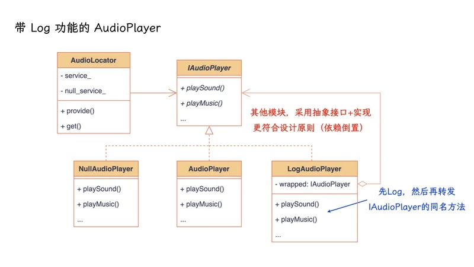